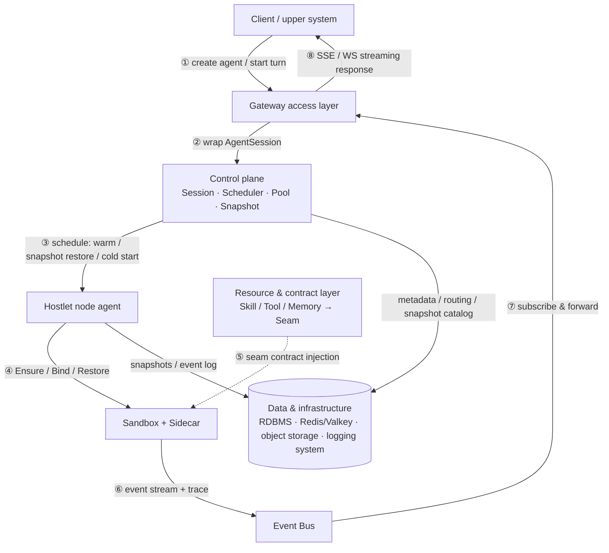
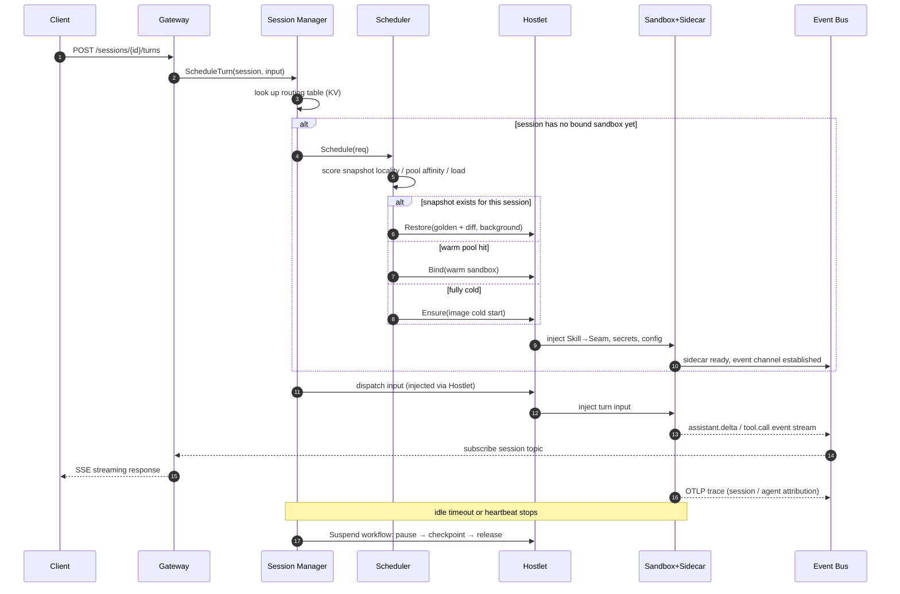
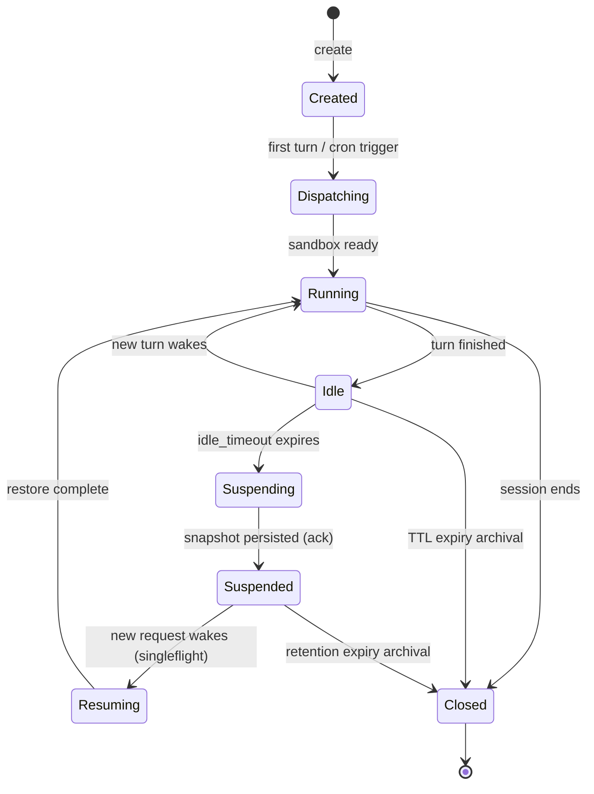
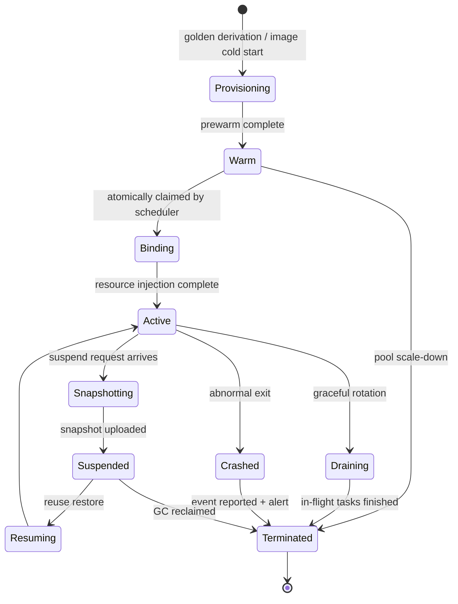

# Agent Runtime Architecture: A Harness-Agnostic Sandboxed Agent Runtime

**English** | [中文](agent-runtime-architecture.zh.md)

> Architecture Design Doc · Working Draft

A platform system that uses AgentSession as the scheduling unit and managed sandboxes as the execution unit. It directly adopts gVisor / Firecracker / microsandbox as the sandbox foundation and dsh as the harness executor. Through component networking and routing, actor/worker multiplexing with snapshot layering, the Capability Seam contract, and similar mechanisms, it enables seamless (harness-agnostic) mounting of any agent harness.

- **Version**: v0.6 (draft, for review)
- **Date**: 2026-08-18
- **Status**: Architecture design phase
- **Code name**: Whirlwind (placeholder)

## Table of Contents

- [01 Design Goals and Core Principles](#01-design-goals-and-core-principles)
- [02 Overall Architecture](#02-overall-architecture)
- [03 Module Definitions](#03-module-definitions)
- [04 Key Interfaces](#04-key-interfaces)
- [05 Domain Model](#05-domain-model)
- [06 Cross-Cutting Design](#06-cross-cutting-design)
- [07 Reference Projects Comparison](#07-reference-projects-comparison)
- [08 Roadmap and Open Questions](#08-roadmap-and-open-questions)
- [09 Why Not Use Kubernetes Directly for the Target Scenario](#09-why-not-use-kubernetes-directly-for-the-target-scenario)
- [10 Deployment Capabilities](#10-deployment-capabilities)
- [References](#references)

---

## 01 Design Goals and Core Principles

One-sentence positioning: treat any agent harness (such as dsh, or a self-developed loop) as a black-box process and place it inside a managed sandbox (gVisor / Firecracker / microsandbox). The platform uniformly handles session routing, sandbox scheduling, snapshot recovery, pool prewarming, event streaming and trace collection, as well as the injection of skill / tool / memory resources.

### 1.1 The Problem to Solve

Agent-like workloads have three inherent characteristics that directly determine the architectural shape. First, **highly bursty loads**: most of the time they wait for input or tool results, and the real execution time is a tiny fraction[1](#cite-1). Second, **untrustworthy executors**: an agent runs code generated by a model and must be isolated in a sandbox, resulting in single-tenancy and a huge number of instances. Third, **fragmented harness ecosystem**: the loops, tools, and session models of different frameworks are incompatible with one another; if the platform binds to any single vendor API, it will be locked in as that vendor evolves.

Therefore the platform's foundation is: the platform only deals with "sandbox + events + capability contract", and never with the internal APIs of any specific harness.

### 1.2 Four Core Principles

| Principle | Meaning | Key Mechanism |
| --- | --- | --- |
| **Harness-Agnostic** | The platform contract only specifies three things: the process runtime environment (sandbox), the event egress (EventTap), and the capability ingress (Seam Provider). Any harness image that satisfies the contract can be hot-plugged and mounted; the platform does not modify any of its code. | dsh execution world aggregation + actor black-box model |
| **Component Networking and Routing** | Three-layer component addressing, lease self-registration, input dispatch through the control plane, output unified into the event bus, pluggable routing policies. Treat agent-session as a request, the sandbox pool as a worker cluster, and snapshot locality as an affinity score. | component addressing / lease discovery / unified event bus |
| **Sandbox as the Execution Unit** | All agent execution happens inside managed sandboxes. Logical executors (session state) are decoupled from physical sandboxes, multiplexed through golden snapshots + diff layers: a small number of warm sandboxes host a large number of dormant sessions. | actor/worker multiplexing + snapshot layering |
| **Two-Layer Resource Contract** | The upper layer keeps the platform concepts of skill / tool / memory, which can be versioned and audited; the lower layer compiles them into Capability Seam (Definition / Provider / Consumer triad), bridged by harness adapters to each harness's native tool protocol. | dsh's Capability Seam contract abstraction |

### 1.3 Non-Functional Capabilities

| Dimension | Capability | Supporting Mechanism |
| --- | --- | --- |
| Activation Latency | Provide multi-level activation paths (warm adoption / snapshot restore / cold start), automatically choose the optimal path by wake frequency, avoiding cold start on every request | warm pool + golden snapshot derivation + background restore (kernel-first) |
| Isolation | Independent sandbox per session; network deny-by-default, egress only allowed through the sidecar proxy, fine-grained target control per seam | SandboxClass isolation matrix + user-space network policy |
| Density | Logical sessions decoupled from physical sandboxes; many dormant sessions multiplex a few active sandboxes; layered snapshot storage controls cost | suspend releases workers + layered snapshot storage |
| Replayability | Every model-visible input can be reconstructed from the event log, supporting resumable disconnects and incident investigation | append-only SessionEvent log (recorded as soon as model-visible) |
| Observability | Every stream can be attributed at the session / agent / sandbox three levels; business events and engineering traces run on two separate channels | sidecar dual channels (event stream + OTLP trace) |
| Extensibility | Sandbox technologies are pluggable via capability bits; adding a new harness requires no change to the platform core | SandboxDriver single interface, multiple implementations + Harness Adapter |

> **Scope (v1)**
> In scope: execution, scheduling, snapshots, event streaming, tracing, cron triggering, resource injection, and agent team message routing for single-agent sessions. Out of scope: multi-agent graph orchestration (a graph abstraction slot is reserved), training and RL scenarios, and cross-cluster federation.

---

## 02 Overall Architecture

A five-layer structure: Gateway access, Agent-Session control plane, Sandbox data plane, resource and contract layer, and data and infrastructure layer. The upper layers only know AgentSession, the lower layers only know Sandbox, and the translation between the two is done by the control plane.

**Figure 1** Overall architecture: five-layer hierarchical view (data flow in Figure 2)


**Figure 2** Data flow: request down-path and event up-path



### 2.1 Component Networking and Routing

Internally, the system organizes all routable execution units into a "component network": each `AgentDefinition` is a class of component, and its executable copies are the Sandbox instances in the sandbox pool. Components are located via three-layer addressing — `tenant` (multi-tenant namespace) → `AgentDefinition` (versioned definition of a class of agent) → `Sandbox instance` (routable execution copy) — with an addressing path shaped like `v1/instances/{tenant}/{agentClass}/{sandboxId}`.

When a Hostlet or sandbox instance starts, it self-registers with the registry (lease heartbeat, removed automatically on TTL expiry); the routing table self-heals accordingly, with no centralized heartbeat scanning. The scheduler makes a routing decision for a session request, scoring on: **snapshot locality** (prefer scheduling onto nodes that hold the session's latest snapshot), warm pool water level, node headroom, and tenant isolation. It is currently assumed that the system runs only one class of sandbox at a time, so scheduling requests need not carry type / labels / resource quota; snapshot affinity is derived automatically by the control plane from the session's historical snapshots.

A sandbox has no inbound request surface; outbound traffic is uniformly proxied through the sidecar: user input is wrapped into an AgentSession by the Gateway and then dispatched by the control plane to be executed in the sandbox — the sandbox exposes no inbound ports; the outbound network of the harness inside the sandbox (LLM calls, tool out-calls, etc.) is uniformly forwarded through the sidecar proxy — LLM requests are made out over the network by the sidecar, which holds the provider credentials and tokens (tokens and secrets never enter the sandbox), and the calls are also recorded for metering and auditing; events and traces are uniformly broadcast over the Event Bus and consumed by the business plane. Prewarmed warm sandboxes and active sandboxes form a two-stage "prewarm / execute" pipeline.

### 2.2 Lease Mechanism: Three-Layer Separation of Responsibilities

Leases in the system are not a single mechanism but three leases at three different locations, with different forms and solving different problems. The core principle is: **the renewer must be the party whose liveness the lease asserts** — the registration lease asserts sandbox liveness and is renewed by the sidecar; the binding lease asserts control-plane liveness and is renewed by the control plane.

| Lease | Form | Renewer | Problem Solved |
| --- | --- | --- | --- |
| **Registration lease (liveness lease)** | Redis lease · TTL 15s · KeepAlive periodic renewal | sidecar / Hostlet (sandbox side) | After a sandbox crashes the key is removed automatically and the routing table self-heals; no centralized heartbeat scanning, avoiding thousands of sandboxes heartbeating one-by-one and overwhelming the registry. |
| **Binding lease (session-holding lease)** | `session→sandbox` binding + control-plane periodic renewal | control plane (owner side) | After the control plane loses contact the lease expires; the sandbox concludes it is no longer held by any session and enters draining / reclamation, preventing orphan sandboxes from occupying resources forever. |
| **Routing epoch (split-brain prevention)** | binding carries a monotonically increasing epoch · requests must carry validation | control plane (incremented on allocation) | After control-plane failover, stale routes linger; the new scheduler increments the epoch and stale requests are rejected by the sandbox, preventing two control planes from operating one sandbox simultaneously. |

### 2.3 Full Lifecycle of a Conversation Request

The cold path (no available sandbox) and the hot path (warm pool hit or snapshot restore) converge in the scheduler into the same Restore/Bind decision, after which the flow is identical:

**Figure 3** Session request sequence: cold start, warm reuse, and snapshot restore converge on three paths



### 2.4 Key Design Decisions

| Decision | Reasoning |
| --- | --- |
| **AgentSession is the only scheduling unit** | The Gateway only produces sessions and is unaware of sandbox details; all control-plane state machines, routing tables, and quotas hang off the session — the "middle concept" running through the whole system. |
| **Logical sessions decoupled from physical sandboxes** | Session state can be snapshotted to disk; sandboxes can be reclaimed and reused; the two are dynamically bound through the KV routing table — a prerequisite for high density. |
| **Sandbox has no inbound request surface; egress goes through the sidecar proxy** | The sandbox exposes no inbound ports; input is dispatched through the control plane; outbound network (LLM calls, etc.) is uniformly proxied by the sidecar, tokens and credentials never enter the sandbox; events and traces uniformly enter the Event Bus for broadcast, consumed by the business plane. |
| **Storage division of labor** | RDBMS stores slow-changing metadata and history (auditable), KV stores high-frequency dynamic state (routing/hot state), object storage stores large objects (snapshots/artifacts), and a dedicated logging system stores the event log. No single storage appears on someone else's hot path. |
| **Sidecar standard suite injected with the sandbox** | EventTap / TraceRelay / Injector / ControlAgent / LLM Relay are the five-piece set forming the only boundary between the platform and the world inside the sandbox — the implementation vehicle for harness-agnostic operation. |
| **golden snapshot + diff layers** | AgentVersion-level golden baseline + instance-level increments (full / data-diff), applied on restore; prewarming derives from golden. |
| **SandboxDriver single interface, multiple implementations** | The three technical routes gVisor / Firecracker / microsandbox are differentiated by capability declarations (caps), and the scheduler selects as needed. The platform directly adopts open-source sandbox technologies and does not implement a sandbox kernel itself. |
| **agent team is an independent first-class entity** | A team is an orchestration unit for a group of agents (an independent entity, many-to-many with agents), declaring a collaboration topology (hub broadcast / direct targeting / router routing). For router topology, the supervising agent is configured at agent definition time (choose a member to double as supervisor, or a built-in supervisor); hub speaking order and message delivery semantics are configurable, with the supervisor specifying defaults. The platform only does message routing and has no built-in orchestration engine. A team does not own sessions: member sessions remain independent, and message delivery is the turn input of the target member session; when the target has no active session, it is woken via standard scheduling. |

---

## 03 Module Definitions

Each module specifies its responsibilities, key behaviors, and failure semantics. Naming follows "layer-number", corresponding to Figure 1.

### 3.1 Gateway Layer

| Module | Name | Responsibilities and Key Behaviors |
| --- | --- | --- |
| G1 | `API Server` | Public REST ingress. CRUD for agents and versions, session creation, message dispatch, event subscription (SSE / WS), cron and keepalive management. Handles tenant auth, rate limiting, and idempotency-key validation. Stateless horizontal scaling. |
| G2 | `Session Assembler` | Wraps various trigger sources (user messages, cron, webhook, team messages) uniformly into `AgentSession` + `TurnRequest`. |
| G3 | `Cron Scheduler` | **Business time trigger**: cron belongs to an agent; at the scheduled time it scans `CronJob`, assembles a synthetic session from the input template, and hands it to G2 for dispatch. It answers "when should this agent do work" — producing new sessions. A distributed lock guarantees at-least-once triggering across the cluster, and trigger requests carry an idempotency key deduplicated by the control plane. |
| G4 | `Keepalive Manager` | **Session keepalive management**: consumes touch heartbeat renewals, determines idle_timeout (silent expiry → suspend) and max_duration (overlong → forced archive). It answers "how much longer can this existing session live" — acting only on existing sessions and never producing new ones. The two share the timing-wheel and distributed-lock infrastructure but are business-wise mutually oblivious and evolve independently: a trigger failure does not affect keepalive decisions, and vice versa. |
| G5 | `Stream Egress` | Subscribes to the `sessions.{id}.stream` topic on the Event Bus and forwards to clients. On disconnect/reconnect, resumes from the event log using event `seq` as the cursor (Last-Event-ID semantics), guaranteeing no loss, no duplication. |

### 3.2 Control Plane (L3)

| Module | Name | Responsibilities and Key Behaviors |
| --- | --- | --- |
| C1 | `Session Manager` | Holder of the AgentSession state machine. Maintains the KV routing table (session → sandbox mapping, with epoch split-brain protection); initiates bind / suspend / resume / close decisions; applies singleflight merging for concurrent wake-ups of the same session (the first request triggers restore, subsequent requests wait and merge). |
| C2 | `Placement Scheduler` | Takes a session's scheduling requirement and outputs candidate sandboxes. Scoring dimensions: snapshot locality, warm pool water level, node headroom, tenant isolation. Policy enum is pluggable: `WarmFirst`, `SnapshotLocal`, `LeastLoaded`, `PowerOfTwo`. Adoption of a warm sandbox is an atomic CAS operation to prevent double-claiming. Only one class of sandbox runs at a time, so no type filtering is needed. |
| C3 | `Lifecycle Engine` | Lifecycle engine; suspend / resume / snapshot / gc are all expressed as `ensure_*` step chains: each step derives progress from persisted state, is idempotent and re-entrant, and each step has its own span. If any step fails, the whole flow stops at the current step; a retry resumes from the breakpoint rather than restarting from scratch. |
| C4 | `Pool Manager` | Maintains the warm target water level of each `SandboxPool`; the prewarm pipeline = deriving new sandboxes from the golden snapshot of the pool's corresponding AgentVersion; performs draining (Draining: finish in-flight tasks, reject new bindings) and pool elastic scaling. |
| C5 | `Snapshot Manager` | Snapshot cataloging and lifecycle. Three kinds of snapshots: golden (AgentVersion-level baseline), full (memory + disk), data-diff (data increments only). Manages manifests, retention policies, reference counting, and GC; orchestrates concurrency and rate limits for upload/download. |
| C6 | `Registry / Discovery` | Hostlets and sandbox instances self-register via Redis lease (removed automatically on TTL expiry); exposes a list-and-watch stream outward. Addressing path: `v1/instances/{tenant}/{agentClass}/{sandboxId}`. |

### 3.3 Data Plane (L2)

| Module | Name | Responsibilities and Key Behaviors |
| --- | --- | --- |
| D1 | `Hostlet` | Node-level daemon (DaemonSet), the "shepherd" of sandboxes. Executes Ensure / Bind / Pause / Checkpoint / Restore / Destroy; handles snapshot upload/download on the node, local snapshot cache, and image GC; reports node capacity and sandbox health events to the control plane. |
| D2 | `SandboxDriver` | Unified abstraction layer for sandbox technologies. Three implementations: `runsc-driver` (gVisor, process-level, high density, native checkpoint), `firecracker-driver` (microVM, strong isolation, memory snapshot mmap-COW restore), `libkrun-driver` (microsandbox, disk snapshot + sub-100ms cold start). Differences are declared via capability bits, which the scheduler uses to filter. |
| D3 | `Sidecar standard suite` | The platform agent installed in every sandbox, combining five responsibilities: EventTap (collects harness output and normalizes it into platform events), TraceRelay (relays in-sandbox OTLP through the tunnel and attaches session / agent attribution), ResourceInjector (injection and mounting of skill / seam provider / secret), ControlAgent (health probes, control commands, graceful shutdown), LLM Relay (outbound proxy for LLM calls inside the sandbox: holds provider credentials and tokens, provides the only network egress path, records calls for metering and auditing). |
| D4 | `Event Bus` | NATS / Redis Stream. Topic convention: `sessions.{id}.stream` (business events), `sessions.{id}.trace` (trace batches), `sandbox.{id}.health`, `pool.{id}.events`. At-least-once delivery; consumers dedupe by seq. |

### 3.4 Resource and Contract Layer (L1)

| Module | Name | Responsibilities and Key Behaviors |
| --- | --- | --- |
| R1 | `Resource Registry` | Versioned registry of skill / tool / memory (RDBMS). A skill is a capability package with metadata (entry point, dependencies, permission declarations); a tool is an executable tool description; a memory is a storage binding (in-session / long-term / vector retrieval). All support content addressing and immutable versions. |
| R2 | `Seam Renderer` | The compiler: takes an AgentVersion definition + resource references as input and outputs a SeamBindings manifest — each binding is a complete triad (Definition interface, Provider implementation, Consumer exposure). The rendered result is injected when the sandbox is created; it is the only translation point from "upper-layer concepts" to "lower-layer contracts". |
| R3 | `Harness Adapter` | One adapter per harness, distributed as "image + config template": dsh maps directly to native seams; other harnesses are uniformly exposed as an MCP Server. On adapter failure it is fail-closed, with no silent degradation. The platform directly adopts dsh as the default harness and does not build a harness core itself. |

> **Why Renderer and Adapter are separated**
> The Renderer cares about "which capabilities this agent needs and with what strategy they are provided" — platform semantics; the Adapter cares about "how these capabilities are exposed to the model in a given harness" — ecosystem semantics. With the two decoupled, adding a harness does not touch the resource model, and adding a resource does not touch any adapter's core logic.

### 3.5 Data Layer (L0)

| Storage | Content | Access Pattern |
| --- | --- | --- |
| RDBMS (PostgreSQL) | Tenants, AgentDefinition / AgentVersion, AgentTeam, session metadata, event index, skill / seam registry, cron, snapshot catalog, audit logs | Low-frequency reads/writes, transactions, audit queries; event bodies go to the dedicated logging system, only the index stays in the database |
| Redis / Valkey | Hostlet / sandbox instance registration (lease TTL), session routing table (hot path), sandbox dynamic state, singleflight locks, distributed locks | Millisecond reads/writes; all rebuildable from RDBMS (loss recoverable) |
| Object storage | Snapshots (memory / vmstate / disk diff), skill artifacts, offline archive of the event log | Append-write, read-on-demand; snapshots organized by manifest, supporting range fetch |
| Dedicated logging system | Session event log (JSONL stream output by EventTap, indexed by session / agent attribution) | Append-write, replay by seq range; query interface kept open (see 8.2), selection added later |

---

## 04 Key Interfaces

Four classes of contracts, from outside in: public REST API, control-plane HTTP API, node-plane HTTP API, in-sandbox Sidecar contract, and finally the resource layer's Seam IDL. Internal services uniformly use HTTP/JSON, avoiding extra RPC frameworks.

### 4.1 Public API (REST)

```text
# ---- Agent management ----
POST   /v1/agents                          Create an AgentDefinition
GET    /v1/agents/{agent}
PUT    /v1/agents/{agent}                   Update the definition (produces a new AgentVersion, triggers golden snapshot rebuild)
POST   /v1/agents/{agent}/versions/{v}/promote   Gradually promote the default version

# ---- Team management (agent team mechanism: independent first-class entity, see 5.1 / 8.2) ----
POST   /v1/teams                           Create an AgentTeam (member agent references + roles + collaboration topology hub / direct / router; router topology must configure a supervisor: choose a member to double as supervisor, or a built-in supervisor agent; hubOrder and delivery are configurable, defaults specified by the supervisor)
GET    /v1/teams/{team}
POST   /v1/teams/{team}:join / :leave      Member dynamically joins / leaves
POST   /v1/teams/{team}/messages           Deliver a message to the team: under hub topology visible to all members, under direct / router topology delivered to target members per routing — uniformly as the turn input of the target session

# ---- Sessions and messages ----
POST   /v1/agents/{agent}/sessions          Create a session
GET    /v1/sessions/{sid}
POST   /v1/sessions/{sid}/turns             Start a conversation turn (response is an SSE stream)
GET    /v1/sessions/{sid}/events?from_seq=  Event replay / resume on reconnect
POST   /v1/sessions/{sid}:resume            Resume a session (suspension is auto-triggered by idle_timeout, no explicit suspend needed)
POST   /v1/sessions/{sid}/heartbeat         touch keepalive renewal (consumed by G4 Keepalive Manager)

# ---- Triggers and management (cron belongs to an agent) ----
POST   /v1/agents/{agent}/crons              Register a cron job for an agent (schedule + input template + session policy)
GET    /v1/agents/{agent}/crons/{id}/runs
GET    /v1/pools · /v1/classes · /v1/snapshots    Management-plane read-only views
```

### 4.2 Control-Plane HTTP API (Gateway → control plane, Hostlet → control plane)

```text
# ---- Scheduling and routing (Gateway → control plane) ----
POST   /internal/control/schedule           # Idempotency key = session_id + epoch; singleflight merging done internally
GET    /internal/control/route?session_id=  # Query the session's current route
POST   /internal/control/suspend
POST   /internal/control/resume
POST   /internal/control/close

# ---- Hostlet upstream (Hostlet → control plane) ----
POST   /internal/control/hosts/register     # Node self-registration (lease renewal)
POST   /internal/control/sandbox-events     # Sandbox event reporting (at-least-once, with seq)

# Request body (JSON)
POST /internal/control/schedule
{
  "session_id": "s_...",
  "agent_id": "a_...",
  "agent_version": "v3"
  // The system runs only one class of sandbox at a time; no class / labels / resource quota / affinity hints needed
  // Snapshot affinity is derived automatically by the control plane from the session's historical snapshots
}
// Response
{
  "sandbox_id": "sb_...",
  "source": "WARM",                      // WARM / SNAPSHOT_FULL / SNAPSHOT_DATA / COLD
  "route_epoch": 42                      // Split-brain prevention: downstream requests must carry it
  // No direct request-surface address: the sandbox exposes no ports to the business plane;
  // input is injected via the control plane and Hostlet, output uniformly goes to the event bus
}
```

### 4.3 Node-Plane HTTP API (control plane → Hostlet)

```text
# ---- Sandbox lifecycle (control plane → Hostlet) ----
POST   /internal/hostlet/ensure            // restore_source: golden | full | data | none (cold start)
POST   /internal/hostlet/bind              // Inject the SeamBindings manifest, secret references, event-channel tickets
POST   /internal/hostlet/turn              // Inject one turn of input into the sandbox (input + context); the sandbox has no direct request-surface port
POST   /internal/hostlet/pause
POST   /internal/hostlet/checkpoint        // kind = FULL (memory+disk) | DATA (data layer only)
POST   /internal/hostlet/destroy           // reason + grace
GET    /internal/hostlet/events            // SSE: Hostlet → control plane event stream
```

### 4.4 SandboxDriver Abstraction (internal to Hostlet)

```rust
#[async_trait]
pub trait SandboxDriver: Send + Sync {
    fn class(&self) -> &'static str;               // "runsc" | "firecracker" | "libkrun"

    fn capabilities(&self) -> Caps {
        Caps {                             // capability bits; the scheduler filters on these
            snapshot_full: bool,           // memory+disk snapshot (firecracker / runsc)
            snapshot_data: bool,           // disk layer only (libkrun)
            background_restore: bool,      // kernel-first restore (runsc)
            net_policy: bool,              // user-space network policy (libkrun)
            density: Density,              // High | Medium | Low
        }
    }

    async fn create(&self, spec: SandboxSpec, from: Option<RestoreSource>)
        -> Result<Instance>;
    async fn exec(&self, id: &str, cmd: ExecSpec) -> Result<ExecStream>;
    async fn pause(&self, id: &str) -> Result<()>;
    async fn checkpoint(&self, id: &str, kind: CheckpointKind)
        -> Result<SnapshotArtifact>;
    async fn restore(&self, art: &SnapshotArtifact, opts: RestoreOpts)
        -> Result<Instance>;               // returns immediately when opts.background = true
    async fn destroy(&self, id: &str, grace: Duration) -> Result<()>;
}
```

**Why not a process / microvm / lightvm three-tier classification**: the three-tier classification is a single-dimension classification by "isolation strength", while real sandbox technologies are combinations of multiple orthogonal dimensions — gVisor is process-level + user-space kernel, Firecracker is microVM hardware isolation, microsandbox is a lightweight VM; they each differ in memory snapshot, disk snapshot, background restore, network mode, cold start, and density. The three tiers force technologies into ill-fitting buckets and cannot express differences like "Firecracker supports memory snapshots but microsandbox does not"; adding WASM, runc containers, or bare processes in the future would mean expanding to four or five tiers.

The correct approach is to upgrade the `capabilities()` capability bits from "auxiliary declaration" to the **sole basis for scheduling decisions**:

```rust
struct Caps {
    isolation: Isolation,        // Process | MicroVM | LightVM | Wasm ...
    snapshot_full: bool,         // memory+disk snapshot
    snapshot_data: bool,         // disk layer only
    background_restore: bool,    // kernel-first restore
    net_policy: bool,            // user-space network policy
    density: Density,            // High | Medium | Low
    cold_start_ms: u32,          // cold-start magnitude, for prewarm-depth decisions
}
```

`class()` is demoted to a human-readable label. The scheduler matches capability bits against the **requirements** declared by the AgentVersion (isolation level, snapshot need, network policy, density), rather than matching "which tier". Adding a sandbox technology = adding one driver implementation + declaring capability bits, without touching scheduler logic. The interface additionally suggests adding `configure_network(policy)` (deny-by-default policy injection) and `mount(spec)` (workspace / seam provider mounting) — network and filesystem mounting are the two surfaces where sandboxes differ most and do not fit into `create`. Currently the system runs only one class of sandbox at a time; the capability bits primarily describe the drivers' own differences and reserve slots for future multi-type extension; the scheduler currently needs no type filtering.

### 4.5 Sidecar Contract (standard in-sandbox suite)

The output of EventTap is a unified JSONL event stream, aligned with the unified session log model (monotonic seq, tagged union types, surface rewrite semantics):

```json
// Events on sessions.{sid}.stream (at-least-once; consumers idempotent by seq)
{"type":"turn/start",        "seq":1021, "ts":1755...,
 "data":{"input_ref":"obj://..."}}
{"type":"assistant/chunk",   "seq":1022, "ts":...,
 "data":{"delta":"Let me first take a look"},
 "surface":{"op":"append"}}                // compaction rewrite uses op=replace + [start,end)
{"type":"tool/call",         "seq":1030, "ts":...,
 "data":{"tool":"fs.write","seam":"fs.v1","args":{...}}}
{"type":"tool/result",       "seq":1031, "ts":..., "data":{...}}
{"type":"turn/end",          "seq":1034, "ts":..., "data":{"usage":{...}}}
```

```text
// Control channel (ControlAgent, HTTP over vsock / UDS)
HealthCheck / PreparePause (flush the event stream) / SnapshotAck / GracefulStop(reason)

// LLM egress channel (LLM Relay, HTTP over vsock / UDS)
POST /llm/chat        // LLM calls from the harness inside the sandbox go out through this: the sidecar attaches provider credentials and attribution, and records calls for metering / auditing
GET  /llm/token       // On-demand short-term token issuance; credentials and tokens never enter the sandbox image / snapshot
```

### 4.6 Seam IDL and Binding Manifest

The three-role definition of Seam is registered via IDL (dual TS / proto forms), and the AgentVersion declares bindings via YAML. The example below shows how the same `fs` capability is exposed differently under three harnesses:

```yaml
# Seam binding declarations in an AgentVersion (input to the Seam Renderer)
seamBindings:
  - seam: fs.v1                       # Definition: registry://seams/fs@1.4.0
    provider:
      name: sandbox-fs                # Provider: in-sandbox implementation, distributed with the image
      policy:
        mode: workspace-write         # read-only | workspace-write | full
        workspaceRoot: /workspace
    consumers:
      - harness: dsh                  # native seam, zero adaptation
      - harness: "*"                  # fallback: exposed as an MCP Server

  - seam: shell.v1
    provider: { name: sandbox-bash, policy: { mode: workspace-write } }
  - seam: memory.v1
    provider:
      name: redis-memory              # Provider on the host side; secrets never enter the sandbox
      endpoint: { kind: host-relay }  # accessed via the sidecar tunnel, gated per target
```

> **Contract layering summary**
> REST faces the caller, HTTP APIs face internal services, the Driver faces sandbox technologies, the Sidecar faces the world inside the sandbox, and Seam faces the capability ecosystem. The five layers of contracts never cross boundaries: the Gateway never directly connects to the Hostlet, the control plane never parses event bodies, and the world inside the sandbox only sees the Sidecar and the injected resources.

---

## 05 Domain Model

The entities fall into three groups: definition group (describing "what an agent is"), runtime group (describing "one execution"), and resource group (describing "what an agent uses"). The relationships:

**Figure 4** Domain model: relationships among the definition, runtime, and resource groups (image version)


### 5.1 Definition Group

| Entity | Key Fields | Description |
| --- | --- | --- |
| `AgentDefinition` | `name · displayName · defaultVersion · owner` | The logical name of a class of agent. What is immutable is the identity; what is mutable is the default-version pointer. |
| `AgentVersion` | `harness · image · entrypoint · sandboxClass · labels · seamBindings[] · skillRefs[] · memoryRefs[]` | The immutable deployment unit: harness type and image, entry point, sandbox level, and capability bindings are all frozen here. **The various seams associated with this agent (shell / fs / memory / subagents, etc.) are declared here via `seamBindings[]`**, frozen together with the version; a version is never modified once created, only replaced. The full / data snapshot tier is not self-selected here; it is decided by `SandboxClass`. |
| `SandboxClass` | `driver · snapshotCaps · netPolicy · density` | Sandbox technology level (gVisor / Firecracker / microsandbox), carrying capability declarations. Currently the system runs only one class, serving as an abstraction slot for future multi-type extension. |
| `AgentTeam` | `name · members[] (AgentDefinition references + role) · topology · supervisor · hubOrder · delivery · quota` | **Independent first-class entity**: an orchestration unit for a group of agents, many-to-many references with agents, and does not belong to any single agent. `topology` declares the collaboration topology among members: `hub` (broadcast — any member's output is visible to all members, suited to group-chat / debate-style collaboration), `direct` (targeted — a member designates target members for point-to-point delivery), `router` (routed — a designated member acts as the router, deciding the next speaking member and its input). `supervisor` declares the supervisor agent of the router topology — **configured at agent definition time**: either choose a member agent to double as supervisor, or build in a dedicated supervisor agent (ordinary member + supervisor role); the platform only executes routing per configuration and implements no orchestration logic. `hubOrder` (free preemption / round-robin) and `delivery` (at-least-once and dedup window) are configurable, with the supervisor specifying defaults at runtime. A team does not own sessions — member sessions remain independent and the principle that the session is the sole execution unit is unchanged; the team only provides message routing: a message delivered to the team becomes the turn input of the target member session, and if the target has no active session it is woken via standard scheduling. Team-level message rate quotas prevent broadcast storms. |

### 5.2 Runtime Group

| Entity | Key Fields | Description |
| --- | --- | --- |
| `AgentSession` | `agentVersionId · status · bindSandboxId · routeEpoch · idleDeadline · maxDuration` | The system-wide scheduling middle concept; the basic unit of scheduling and billing. |
| `SessionEvent` | `sessionId · seq · type · ts · data · surface` | A row of the append-only log. `seq` is monotonically contiguous within a session; `surface` carries append / replace semantics. |
| `Sandbox` | `classId · poolId · workerId · status · bindSessionId · lastSnapshotId` | The physical executor. Lifecycle independent of sessions: prewarmed by a pool, leased by a session, reclaimed after snapshot. |
| `Worker` | `nodeId · capacity · state(ACTIVE/DRAINING) · labels` | Node capacity view managed by the Hostlet; input to capacity-aware scheduling. |
| `Snapshot` | `kind(golden/full/data) · subject · manifest · location · size · merkle` | golden points to an AgentVersion (template baseline); full / data point to a concrete sandbox (instance increments). The manifest describes the layered structure; the merkle root is used for integrity checks. |
| `CronJob` | `agentDefinitionId · schedule · inputTemplate · sessionPolicy` | Time-triggered definition, subordinate to an agent (`agentDefinitionId` foreign key): at the scheduled time G3 assembles a synthetic session for that agent. |

### 5.3 Resource Group

| Entity | Key Fields | Description |
| --- | --- | --- |
| `SkillPackage` | `kind · version · contentRef · permissions[]` | Upper-layer concept: skill package (entry point, dependencies, permission declarations). Versions are immutable and content-addressed. |
| `MemoryStore` | `type(session/longterm/vector) · backend · namespace` | Storage-binding declaration. In-session memory travels with the snapshot; long-term memory is accessed via host-relay. |
| `SeamBinding` | `seamId · providerSpec · consumers[]` | Lower-layer contract: the Renderer's compiled output, injected into the sandbox with the Bind request. |

### 5.4 State Machines

The two state machines are offset by half a beat: the session first enters a suspend intent, then the sandbox completes its snapshot and returns to the pool. Session state is the user-facing source of truth; sandbox state is the resource-facing source of truth:

**Figure 5** AgentSession state machine



**Figure 6** Sandbox state machine



> **ensure step chain of the suspend workflow (executed by the Lifecycle Engine)**
> `ensure_actor_lock` → `ensure_paused` (flush the event stream + freeze processes) → `ensure_snapshot_uploaded` (full or data, per policy) → `ensure_route_cleared` (delete the KV route) → `ensure_worker_released` (sandbox returns to pool or is destroyed) → `finalize_suspended`. Each step is idempotent, re-entrant, and has its own span; the resume workflow is its mirror (lock → resolve bootstrap source → claim worker → restore → finalize_running).

---

## 06 Cross-Cutting Design

### 6.1 Observability: Dual Channels and Attribution

The sidecar's two egress channels serve different consumers. **The business event stream** (EventTap → Event Bus → Stream Egress / event log) faces end users and session replay, its semantics being "what the model saw and did"; **the trace channel** (TraceRelay → OTLP collector → backend) faces engineering observation, its semantics being "how the agent executes internally". All telemetry leaving the sandbox uniformly attaches three-level attribution: `session_id / agent_id / sandbox_id`. The event log simultaneously acts as the source of truth for auditing: any complaint or incident investigation starts by replaying a seq range, not by stitching together log fragments.

### 6.2 Security and Multi-Tenancy

| Layer | Measures |
| --- | --- |
| Sandbox isolation matrix | The system currently runs only one class of sandbox (default gVisor, high density). The isolation matrix serves as a reference for future multi-type extension: gVisor (process-level + user-space kernel), Firecracker (microVM, strong isolation, for high-risk tasks), microsandbox (lightweight VM). |
| Network | Deny-by-default egress policy; the sandbox has no inbound ports and all egress goes through the sidecar proxy (LLM calls, seam host-relay); private-net / loopback / cloud metadata addresses are all rejected; DNS pin + SNI binding prevent spoofing; fine-grained per-seam target admission. |
| Credentials | Secrets never enter the sandbox image or snapshot: kept on the host side, injected through sidecar host-relay gated by target, forcibly stripped before snapshot. |
| Host hardening | MicroVM processes are jailerized: chroot, cgroup, fd clearing, uid/gid drop, only necessary device nodes injected. |
| Quotas | Four tenant-level quotas — concurrent sandbox count, snapshot storage, event throughput, cron frequency — enforced in both the Gateway and the scheduler; team-level quotas are designed together with the team mechanism (see 8.3). |

### 6.3 Capacity, Pooling, and Cost

The warm water level is not a static number; the Pool Manager adjusts it by signals: `target = recent wake rate × restore duration × safety factor + reservation`, and prewarms ahead of predictable wake spikes according to the cron calendar. Node-memory overcommit relies on two supports: the process-level footprint of the gVisor tier is naturally oversellable; the Firecracker tier uses balloon devices to reclaim dormant pages. Snapshot storage cost is controlled by layering — golden is fully retained, instance full snapshots are limited in retention count, and long-dormant sessions are downgraded to data snapshots + event log (restore via golden + data rebuild + log replay of context).

#### Prewarm Pipeline: Moving Cold-Start Costs Forward to Publish Time

The essence of prewarming is making "activation latency p95 < 100ms" possible — shifting cold-start costs like image pulling, dependency installation, and process startup from "when the request arrives" to "when the AgentVersion is released" and "when idle". The pipeline:

| Stage | Action | Timing |
| --- | --- | --- |
| ① golden snapshot | Build the baseline snapshot on AgentVersion release (image + dependencies + base context); everything later derives from it | At publish |
| ② COW derivation | Derive instances from golden via copy-on-write, avoiding repeated cold starts | At prewarm |
| ③ Restore startup | mmap-COW on-demand paging / background restore (gVisor kernel-first restore, first instruction executes immediately) | At prewarm |
| ④ inject sidecar | Inject the five-piece set EventTap / TraceRelay / Injector / ControlAgent / LLM Relay | At prewarm |
| ⑤ Warm standby | Register into the pool awaiting adoption; the scheduler adopts via atomic CAS (preventing two schedulers grabbing the same warm sandbox) | After prewarm |

**Layered prewarming controls cost**: shallow prewarm only pulls the snapshot to the node and mmap-loads it, with the process not started and background restore used on adoption; deep prewarm already starts the process and injects the sidecar, with the lowest adoption latency but the highest memory. Prewarm depth is decided by wake frequency — high-frequency agents get deep prewarm, low-frequency agents get shallow prewarm or direct cold start. The water-level formula and cron-calendar prewarm are described above.

---

## 07 Reference Projects Comparison

Every key mechanism in this design can be traced back to a concrete implementation. Reference repositories: [Dynamo](https://github.com/ai-dynamo/dynamo), [Substrate](https://github.com/agent-substrate/substrate), [DeepSeek Harness](https://github.com/deepseek-ai/deepseek-harness), [AgentScope](https://github.com/agentscope-ai/agentscope), [Firecracker](https://github.com/firecracker-microvm/firecracker), [gVisor](https://github.com/google/gvisor), [microsandbox](https://github.com/microsandbox/microsandbox). The comparison table:

| Mechanism of This Design | Source | Concrete Implementation Borrowed |
| --- | --- | --- |
| Three-layer addressing and lease registration | [Dynamo](https://github.com/ai-dynamo/dynamo) | Component / Endpoint / Instance in `lib/runtime/src/component.rs`; etcd lease TTL registration and the list-and-watch trait abstraction (pluggable etcd / K8s / mock). |
| Unified event bus output | [Dynamo](https://github.com/ai-dynamo/dynamo) | ZMQ/NATS broadcast (KV blocks, loads) and TCP direct-connect (requests) dual planes; this system only takes the broadcast plane: input is dispatched through the control plane, output uniformly goes into the Event Bus, with no request-plane direct connection. |
| Routing policy enum | [Dynamo](https://github.com/ai-dynamo/dynamo) | RoundRobin / PowerOfTwo / LeastLoaded in `routing_policy/types.rs`; `cache_hits` affinity generalized into a snapshot-locality score. |
| actor / worker multiplexing | [Substrate](https://github.com/agent-substrate/substrate) | Actor state machine (RUNNING/SUSPENDED/...), Worker capacity-aware scheduling, warm pool; the 100ms p95 activation-latency north-star metric. |
| ensure step workflow | [Substrate](https://github.com/agent-substrate/substrate) | The idempotent step chain in `workflow_resume.go` (lock → bootstrap source → volumes → claim → restore → finalize), each step deriving progress from persisted state. |
| Proxy-side wakeup | [Substrate](https://github.com/agent-substrate/substrate) | Envoy ext_proc interception + singleflight dedup wakeup + request parking (backoff and wait when no idle worker). |
| golden snapshot layering | [Substrate](https://github.com/agent-substrate/substrate) | ActorTemplate-level golden + instance Full/Data snapshots; configurable `onResume: Golden \| ColdBoot`. |
| CRD (slow-changing) / KV (high-frequency) two-layer API | [Substrate](https://github.com/agent-substrate/substrate) | WorkerPool / ActorTemplate go declarative; Actor / Worker dynamic state goes to ValKey; avoids high-frequency writes hitting the apiserver. |
| Capability Seam triad | [DeepSeek Harness](https://github.com/deepseek-ai/deepseek-harness) | Service Definition / Provider / Consumer three roles (`docs/capability-seams.zh.md`); about 30 official seams (shell, fs, subagents, storage, sessionPersistence...). |
| fail-closed sandbox policy | [DeepSeek Harness](https://github.com/deepseek-ai/deepseek-harness) | `SandboxProvider.confine(argv, policy)`: policy carried per call, `enforcement: full \| partial` explicitly declared, error out with no fallback when no backend is available. |
| append-only session log | [DeepSeek Harness](https://github.com/deepseek-ai/deepseek-harness) | `SessionEvent{type,seq,time,data}`, surface replace semantics, `end-seed` fork boundary, and the "recorded as soon as model-visible" invariant. |
| Sandbox-as-workspace layering | [AgentScope](https://github.com/agentscope-ai/agentscope) | `WorkspaceBase → SandboxedWorkspaceBase` two-layer abstraction; a new backend only implements `_provision_backend`; nine backends registered side by side. |
| Unified streaming tool interface | [AgentScope](https://github.com/agentscope-ai/agentscope) | `Toolkit.call_tool → AsyncGenerator[ToolChunk \| ToolResponse]`, fine-grained event stream (including HITL confirmation events). |
| Large-result offload | [AgentScope](https://github.com/agentscope-ai/agentscope) / [dsh](https://github.com/deepseek-ai/deepseek-harness) | `workspace://` URL reference + context offload; dsh spillStore is the same idea. |
| mmap-COW snapshot restore | [Firecracker](https://github.com/firecracker-microvm/firecracker) | Memory file MAP_PRIVATE on-demand paging load, restore latency decoupled from memory size; diff snapshot (dirty-page log) + rebase merge; network/vsock override on clone. |
| Background restore | [gVisor](https://github.com/google/gvisor) | `runsc checkpoint --background`: kernel restored first, application executes immediately, remaining memory filled back asynchronously with page-fault priority, lowering first-instruction latency. |
| seccheck-style event egress | [gVisor](https://github.com/google/gvisor) | Sandbox actively connects to an external UDS sink to push structured events + declarative config; the prototype of this system's EventTap. |
| Draining and keepalive semantics | [microsandbox](https://github.com/microsandbox/microsandbox) | Draining state (finish in-flight, reject new requests); ping (no renewal) / touch (renewal) distinction; built-in idle_timeout / max_duration exit-reason codes. |
| Disk snapshot + warm derivation | [microsandbox](https://github.com/microsandbox/microsandbox) | Captures only the writable layer + Merkle integrity tree; warm workers mode: baseline snapshot repeatedly COW-derives independent workers. |
| Host-side secret gating | [microsandbox](https://github.com/microsandbox/microsandbox) | Secrets never enter the VM, injected host-side and admitted per target host; paired with DNS pin / SNI binding. |

---

## 08 Roadmap and Open Questions

### 8.1 Milestones

| Phase | Goal | Deliverables |
| --- | --- | --- |
| M1 | Single-node vertical slice working | Single-process all-in-one mode (in-memory provider, see 10.4); Gateway (agent CRUD + session + SSE); single SandboxClass (starting with gVisor); one dsh harness adapter; event log (local JSONL); minimal EventTap event set (turn / chunk / tool). |
| M2 | Complete lifecycle | Lifecycle Engine (suspend / resume step chains); gVisor driver + checkpoint; golden snapshot and prewarm derivation; heartbeat / idle_timeout / Draining. |
| M3 | Multi-node and pooling | Hostlet + Redis registration discovery; snapshot-locality routing; warm pool water-level management; Firecracker driver (strong-isolation tier); Seam Renderer + dsh adapter; end-to-end OTLP tracing. |
| M4 | Scale-out operations | Multi-tenant quotas and audit reports; snapshot GC and storage-layering downgrade; microsandbox lightweight tier; cron-calendar prewarm; capacity elasticity; agent team mechanism landing (message routing + collaboration protocol). |

### 8.2 Decided Decisions

- **Event log storage**: The event log later goes to a dedicated logging system, not shouldering long-term audit storage in RDBMS / object storage; RDBMS keeps only the event index and metadata.
- **Snapshot default tier**: The full / data snapshot tier is decided by SandboxClass, not left to the AgentVersion's `snapshotPolicy`.
- **Seam and MCP positioning**: Seam is the top-level abstraction; MCP is only a fallback Consumer and not a platform first-class citizen; the Seam layer keeps the full responsibility of the registry and policy layer.
- **subagent ownership**: Subagents inside the harness are black-box internal details of the sandbox; the platform only sees the event stream, does not create a separate AgentSession, and does not bill or quota them.
- **LLM requests and token ownership**: LLM calls and token management are one class of sidecar responsibilities (LLM Relay). LLM calls inside the sandbox go out through the sidecar, provider credentials and tokens never enter the sandbox, and calls are recorded for metering and auditing.
- **Control-plane technology stack**: Python (asyncio + FastAPI). The control plane is orchestration logic, I/O-bound rather than compute-bound, and not a performance bottleneck; the hot path is inside the sandbox; the Hostlet wraps runsc / firecracker binary orchestration with subprocess.
- **agent team mechanism**: A team is an independent first-class entity (many-to-many with agents, subordinate to no agent), declaring a collaboration topology (hub broadcast / direct targeted / router routed). A team does not own sessions and only does message routing: delivered messages become the turn input of the target member session, woken via standard scheduling when the target has no active session.
- **Router-topology supervisor configured at definition**: The router of the router topology (supervisor agent) is not built into the platform but configured at agent definition time — when creating a team, either choose a member agent to double as supervisor, or build in a dedicated supervisor agent (ordinary member + supervisor role). The platform only executes routing per configuration and implements no orchestration logic.
- **Hub speaking order and delivery semantics configurable**: Both the hub topology's speaking order (free preemption / round-robin) and message delivery semantics (at-least-once and dedup window) are configurable at team definition; when unset, the supervisor specifies them at runtime. The platform only executes per configuration and has no built-in fixed policy.
- **Time-trigger and keepalive split**: Cron triggering (G3, producing new sessions) and keepalive decisions (G4, acting on existing sessions) are two businesses, module-independent and mutually oblivious, sharing only the timing-wheel and distributed-lock infrastructure.
- **Event log query**: No query engine is locked in; the platform only guarantees the minimal interface of "replay by session + seq" (consumable via SSE / REST); audit queries and full-text search are handled by the logging system added later, with the interface kept open.

### 8.3 Open Questions (Closed)

The landing details of the agent team mechanism have all converged into decided decisions (see 8.2): the supervisor agent is configured at definition, and hub speaking order and message delivery semantics are configurable (defaults by the supervisor). There are currently no open questions awaiting collective decisions.

> **Next step suggestion**
> Open questions are closed; freeze the M1 vertical slice scope and enter implementation.

---

## 09 Why Not Use Kubernetes Directly for the Target Scenario

The system runs on a cluster of nodes but does not treat Kubernetes as the runtime kernel. K8s manages "deployment topology" (which services run on which nodes); this system manages "sessions and sandboxes" (which session is in which sandbox, in what state, and when to suspend/resume). The two have different responsibilities; expressing this system's core mechanisms directly with K8s runs into the following mismatches:

| Mismatch | Kubernetes Model | This System's Need |
| --- | --- | --- |
| Scheduling frequency and granularity | Pod scheduling faces minute-level creation and day-level lifetime services; declarative reconciliation through the apiserver tops out at a few hundred writes per second per cluster | The scheduling unit is an AgentSession: one conversation traverses warm adoption → snapshot restore → execution → suspend → release with many high-frequency transitions — sub-second adoption, up to hundreds/thousands of routing decisions per second; the hot path must not go through the apiserver |
| Missing suspend/resume primitives | No first-class suspend / resume / snapshot. Stopping a Pod loses memory state; "resume" can only rebuild the process | Preserving memory state is the core value: mmap-COW restore, golden derivation, diff-layer stacking. These must be managed at the sandbox layer, which amounts to rebuilding a runtime layer above K8s — the Pod is just a redundant middle layer |
| Sandbox is not a Pod | One Pod one cgroup tree, density in units of Pods; K8s completely ignores Pod-internal structure | One Worker node multiplexes dozens to hundreds of managed sandboxes (gVisor / Firecracker / microsandbox). One-sandbox-per-Pod makes density and startup overhead unacceptable; one-Pod-many-sandboxes makes K8s' scheduling, QoS, and eviction semantics for sandboxes all fail |
| Resource model cannot express the dormant state | request / limit describe standing compute reservations; StatefulSet volumes bind to nodes | Many sessions are in snapshot state: consume storage, not compute, with dormant sessions and active sandboxes multiplexed at ~20:1. K8s has no corresponding resource shape, so everything must be stuffed into custom resources, returning to the hot-path-writes-apiserver problem |
| Different scheduling semantics | The scheduler faces node topology: resource requests, affinity, taint toleration; extension requires the scheduler framework, complex and inseparable from the apiserver | The scheduler faces session semantics: snapshot locality, warm pool water level, SeamBindings affinity, resource-pool water level. The scorer needs to directly operate the sandbox pool, not queue for Pod binding |
| Delivery weight | A complete control plane (apiserver / etcd / scheduler / controller-manager / kubelet) + CNI + CSI is a hard dependency of components numbering in the several-dozen minimum | The target scenario includes single-machine and on-prem delivery, requiring a single-process form with zero external dependencies (see 10.4). With K8s as a prerequisite, this form does not exist |

**Conclusion**: It is not "K8s cannot be used", but division of labor — K8s only does what it is good at (module-unit deployment, scaling, node management); session scheduling, sandbox lifecycle, and the snapshot system are self-managed by this system's control plane. The reference project Substrate's CRD (slow-changing) / KV (high-frequency) two-layer API is the same conclusion: the declarative API only holds slow-changing resources (WorkerPool / templates), while all high-frequency dynamic state goes through an independent KV hot path. Therefore in this system K8s appears as "one deployment form" (10.5), not the runtime kernel.

---

## 10 Deployment Capabilities

The same set of module code supports two deployment forms: single-process all-in-one (zero external dependencies) and k8s / k3s clusters. The key to replaceability is that storage and communication all go through provider interfaces.

### 10.1 Deployment Units

| Deployment Unit | Modules | Statefulness | Scaling |
| --- | --- | --- | --- |
| `gateway` | G1 API Server · G2 Session Assembler · G3 Cron Scheduler · G4 Keepalive Manager · G5 Stream Egress | Stateless (session cursors live in the storage layer) | Horizontal multi-replica, client-side load balancing |
| `control` | Router · Lifecycle Engine · Scheduler | Coordinator (all state in the storage layer, process stateless) | Multi-replica sharding (by session hash) or active/standby |
| `hostlet` | Hostlet + SandboxDriver + sidecar injector | Node-level stateful (manages this node's sandboxes) | One per node, scales with the node |
| `storage` | MetadataStore · KVStore · EventBus · ObjectStore · EventLog (all provider interfaces, see 10.3) | Persistence layer | Individually scaled per selection |

The sandbox is not an independent deployment unit: it is created/destroyed on demand by the control plane following the hostlet lifecycle.

### 10.2 Inter-Module Communication Forms

| Communication Path | Form | In Single-Process Mode |
| --- | --- | --- |
| client ↔ gateway | REST + SSE / WS | Unchanged (localhost loopback) |
| gateway ↔ control | Internal HTTP/JSON (`/internal/control/*`) | Degrades to in-process function calls (same event loop) |
| control ↔ hostlet | Internal HTTP/JSON (`/internal/hostlet/*`) | Degrades to in-process function calls |
| hostlet ↔ sidecar | vsock / UDS (HTTP over) | Unchanged (the sandbox boundary does not change with deployment form) |
| Event stream | EventBus pub/sub (`sessions.{id}.stream` and other topics) | In-process asyncio queue |

All inter-module communication has only two carriers: HTTP/JSON requests and EventBus messages — no shared memory, no tightly-bound IPC. This is the precondition for lossless degradation in single-process mode.

### 10.3 System Dependencies and Replaceability

All external dependencies converge into five provider interfaces; modules only depend on interfaces; implementations are replaced independently per storage category without changing module code:

| Dependency Abstraction | Content | Single-Process Implementation | Cluster Implementation |
| --- | --- | --- | --- |
| `MetadataStore` | Tenants, Agent / Version, Team, session metadata, event index, cron, audit | In-memory; optional SQLite persistence for restart durability | PostgreSQL |
| `KVStore` | lease registration, session routing table, sandbox dynamic state, distributed locks | In-memory (the single process is the sole authority) | Redis / Valkey |
| `EventBus` | Event-stream fan-out (stream / trace / control-notification topics) | In-process asyncio queue | NATS / Redis Streams |
| `ObjectStore` | snapshots (memory / vmstate / disk diff), skill artifacts | Local directory | S3 / MinIO |
| `EventLog` | append-only session event log | Local JSONL file | Dedicated logging system (query interface open, see 8.2) |

### 10.4 Single-Process Mode (all-in-one)

- **Form**: One process contains all modules of gateway, control, hostlet plus in-memory storage implementations; the sandbox foundation (runsc / firecracker) still runs as local subprocesses, and sandbox isolation is not weakened by single-process mode.
- **Zero external dependencies**: No PostgreSQL, no Redis, no NATS, no object storage; all five providers are implemented in-memory / by local files, usable out of the box.
- **Persistence optional**: Pure in-memory by default (lost on restart, suited to dev / CI / demo); when persistence is on, MetadataStore uses SQLite and snapshots / event logs write to a local directory, restoring dormant sessions from snapshots after restart.
- **Limitations**: Single-node capacity, no high availability; suited to development, demos, single-machine on-prem, and small-scale evaluation, not a production form.
- **Extension point**: Multi-process on a single machine (systemd / docker compose) is the natural intermediate form between single-process and cluster — modules split into processes while dependencies still use local files and embedded implementations; not elaborated here.

### 10.5 k8s / k3s Cluster Mode

| K8s Object | Deployment Content | Notes |
| --- | --- | --- |
| Deployment + HPA | gateway | Stateless, scales by QPS / SSE connection count |
| Deployment | control | Multi-replica sharded by session; active/standby mode adds lease-lock leader election |
| DaemonSet | hostlet | One per node; nodes must pre-install the sandbox foundation binaries (runsc / firecracker), Pods need device and privilege toleration |
| Stateful dependencies | PostgreSQL · Redis/Valkey · NATS · object storage | Cloud-managed or Operator-deployed; EventLog connects to the dedicated logging system |
| PVC / hostPath | Node-local snapshot cache | Snapshot bodies live in object storage; nodes only hold a hot cache locally |

Here K8s is only responsible for deploying and scaling module units; session scheduling, sandbox lifecycle, and the snapshot system are all self-managed by control (rationale in chapter 09). k3s uses the same manifests, targeting edge and lightweight on-prem scenarios.

---

## References

1. Google, Agent Substrate Architecture. Actor/worker multiplexing, snapshot layering, and the activation-latency target of 100ms p95. <https://github.com/agent-substrate/substrate/blob/main/docs/architecture.md>
2. NVIDIA, Dynamo. Distributed inference service framework: component addressing, etcd lease discovery, broadcast event plane, pluggable routing. <https://github.com/ai-dynamo/dynamo>
3. DeepSeek, Harness. Everything is a plugin: Cordis plugin kernel and the Capability Seam abstraction. <https://deepseek.com/harness/en/>
4. DeepSeek, deepseek-harness source repository. <https://github.com/deepseek-ai/deepseek-harness>
5. AgentScope team, AgentScope 2.x source repository. <https://github.com/agentscope-ai/agentscope>
6. microsandbox project source repository. <https://github.com/microsandbox/microsandbox>
7. AWS, Firecracker source repository. <https://github.com/firecracker-microvm/firecracker>
8. Google, gVisor source repository. <https://github.com/google/gvisor>
