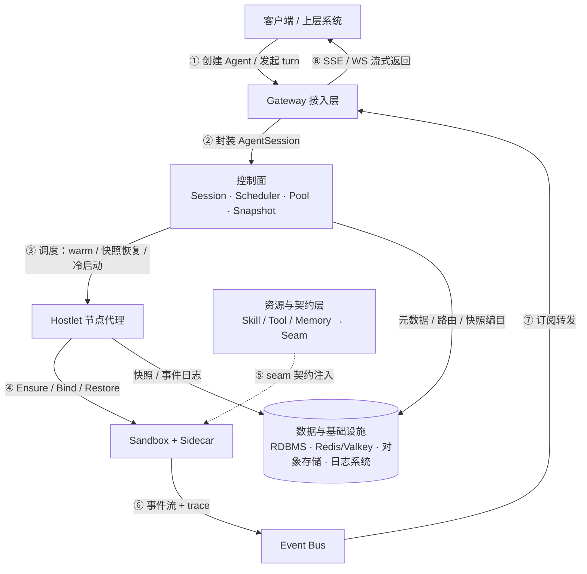
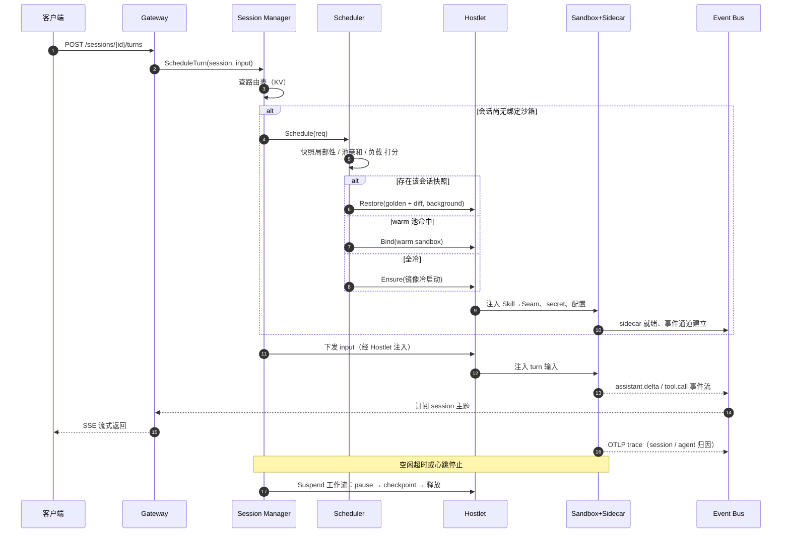
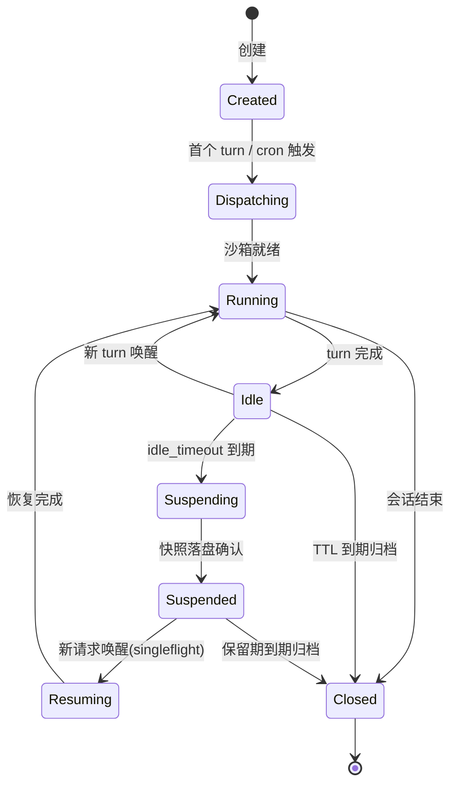
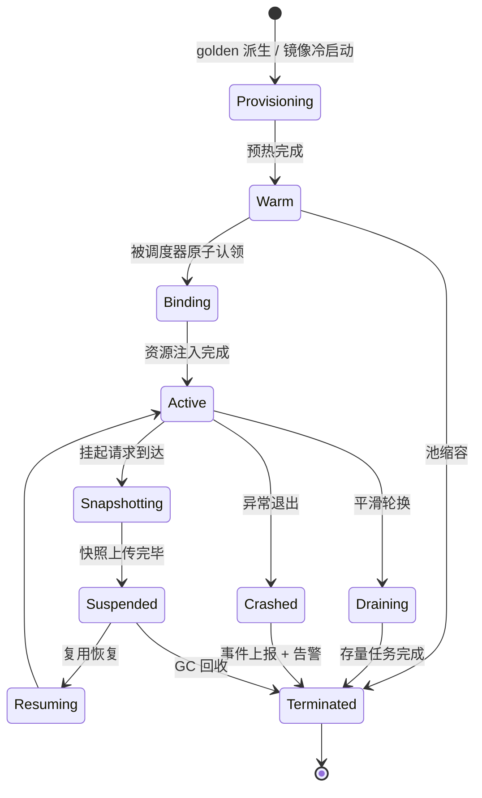

# Agent Runtime 架构设计：harness 无感的沙箱化智能体运行时

[English](agent-runtime-architecture.md) | **中文**

> 架构设计文档 · 工作草案

以 AgentSession 为调度单元、以受管沙箱为执行单元的平台系统。直接采用 gVisor / Firecracker / microsandbox 作为沙箱底座、dsh 作为 harness 执行体，通过组件网络与路由、actor/worker 多路复用与快照分层、Capability Seam 能力契约等机制，实现任意 agent harness 的无感挂载。

- **版本**：v0.6（草案，供评审）
- **日期**：2026-08-18
- **状态**：架构设计阶段
- **代号**：Whirlwind（占位）

## 目录

- [01 设计目标与核心原则](#01-设计目标与核心原则)
- [02 总体架构](#02-总体架构)
- [03 模块定义](#03-模块定义)
- [04 关键接口](#04-关键接口)
- [05 领域模型](#05-领域模型)
- [06 横切设计](#06-横切设计)
- [07 参考项目对照](#07-参考项目对照)
- [08 演进路线与开放问题](#08-演进路线与开放问题)
- [09 为什么目标场景不直接用 Kubernetes](#09-为什么目标场景不直接用-kubernetes)
- [10 部署能力](#10-部署能力)
- [参考来源 / References](#参考来源--references)

---

## 01 设计目标与核心原则

一句话定位：把任意 agent harness（如 dsh，或自研 loop）当作黑盒进程装进受管沙箱（gVisor / Firecracker / microsandbox），平台统一负责会话路由、沙箱调度、快照恢复、池化预热、事件流与 trace 采集，以及 skill / tool / memory 资源的注入。

### 1.1 要解决的问题

agent 类负载有三个与生俱来的特征，直接决定了架构形态。其一，**负载高度突发**：绝大多数时间在等待输入或工具结果，真正执行的时间占比很低[1](#cite-1)。其二，**执行体不可信**：agent 会运行模型生成的代码，必须隔离在沙箱中，导致单租户、实例海量。其三，**harness 生态碎片化**：各框架的循环、工具、会话模型互不兼容，平台若绑定任何一家 API 就会随其演进被锁死。

因此系统的立足点是：平台只与「沙箱 + 事件 + 能力契约」打交道，永远不与具体 harness 的内部 API 打交道。

### 1.2 四条核心原则

| Principle 原则 | Meaning 含义 | Key Mechanism 机制要点 |
| --- | --- | --- |
| **Harness-Agnostic 无感** | The platform contract only specifies three things: the process runtime environment (sandbox), the event egress (EventTap), and the capability ingress (Seam Provider). Any harness image that satisfies the contract can be hot-plugged and mounted; the platform does not modify any of its code. | dsh execution world aggregation + actor black-box model |
| **Component Networking and Routing 组件网络与路由** | Three-layer component addressing, lease self-registration, input dispatch through the control plane, output unified into the event bus, pluggable routing policies. Treat agent-session as a request, the sandbox pool as a worker cluster, and snapshot locality as an affinity score. | component addressing / lease discovery / unified event bus |
| **Sandbox as the Execution Unit 沙箱即执行单元** | All agent execution happens inside managed sandboxes. Logical executors (session state) are decoupled from physical sandboxes, multiplexed through golden snapshots + diff layers: a small number of warm sandboxes host a large number of dormant sessions. | actor/worker multiplexing + snapshot layering |
| **Two-Layer Resource Contract 双层资源契约** | The upper layer keeps the platform concepts of skill / tool / memory, which can be versioned and audited; the lower layer compiles them into Capability Seam (Definition / Provider / Consumer triad), bridged by harness adapters to each harness's native tool protocol. | dsh's Capability Seam contract abstraction |

### 1.3 非功能能力

| Dimension 维度 | Capability 能力描述 | Supporting Mechanism 支撑机制 |
| --- | --- | --- |
| Activation Latency 激活延迟 | Provide multi-level activation paths (warm adoption / snapshot restore / cold start), automatically choose the optimal path by wake frequency, avoiding cold start on every request | warm pool + golden snapshot derivation + background restore (kernel-first) |
| Isolation 隔离 | Independent sandbox per session; network deny-by-default, egress only allowed through the sidecar proxy, fine-grained target control per seam | SandboxClass isolation matrix + user-space network policy |
| Density 密度 | Logical sessions decoupled from physical sandboxes; many dormant sessions multiplex a few active sandboxes; layered snapshot storage controls cost | suspend releases workers + layered snapshot storage |
| Replayability 可回放 | Every model-visible input can be reconstructed from the event log, supporting resumable disconnects and incident investigation | append-only SessionEvent log (recorded as soon as model-visible) |
| Observability 可观测 | Every stream can be attributed at the session / agent / sandbox three levels; business events and engineering traces run on two separate channels | sidecar dual channels (event stream + OTLP trace) |
| Extensibility 可扩展 | Sandbox technologies are pluggable via capability bits; adding a new harness requires no change to the platform core | SandboxDriver single interface, multiple implementations + Harness Adapter |

> **范围界定（v1）**
> 纳入：单 agent 会话的执行、调度、快照、事件流、trace、cron 触发、资源注入、agent team 消息路由。不纳入：多 agent 图编排（预留 graph 抽象位）、训练与 RL 场景、跨集群联邦。

---

## 02 总体架构

五层结构：Gateway 接入、Agent-Session 控制面、Sandbox 数据面、资源与契约层、数据与基础设施层。上层只认 AgentSession，下层只认 Sandbox，两层之间的翻译由控制面完成。

**图 1** 总体架构：五层分层视图（数据流见图 2）


**图 2** 数据流：请求下行路径与事件上行路径



### 2.1 组件网络与路由

系统内部以「组件网络」组织所有可路由的执行单元：每个 `AgentDefinition` 是一类组件，其可执行副本是沙箱池中的 Sandbox 实例。组件通过三层寻址定位——`tenant`（多租户命名空间）→ `AgentDefinition`（一类 agent 的版本化定义）→ `Sandbox 实例`（可路由的执行副本），寻址路径形如 `v1/instances/{tenant}/{agentClass}/{sandboxId}`。

Hostlet 与沙箱实例启动时向注册中心自注册（lease 心跳，TTL 到期自动摘除），路由表据此自愈，无需中心化心跳扫描。调度器对一次会话请求做路由决策，打分维度：**快照局部性**（优先调度到持有该会话最新快照的节点）、warm 池水位、节点余量、租户隔离。当前假定系统同时只运行一类 sandbox，调度请求无需携带类型 / 标签 / 资源额度，快照亲和由控制面根据会话历史快照自动推导。

沙箱无入站请求面，出站统一经 sidecar 代理：用户输入经 Gateway 封装为 AgentSession 后由控制面调度到沙箱执行，沙箱不暴露任何入站端口；沙箱内 harness 的出站网络（LLM 调用、工具外呼等）统一经 sidecar 代理转发——LLM 请求由 sidecar 持有 provider 凭证与 token 代为出网，token 与密钥不进沙箱，调用同时被记录用于计量与审计；事件与 trace 统一经 Event Bus 广播，业务面订阅消费。预热好的 warm 沙箱与活跃沙箱分工，构成「预热 / 执行」两段式流水线。

### 2.2 租约机制：三层职责分离

系统内的 lease 不是单一机制，而是三个不同位置的租约，形式不同、解决的问题也不同。核心原则是：**续租方必须是它所断言存活的那一方**——注册租约断言沙箱存活，由 sidecar 续；绑定租约断言控制面存活，由控制面续。

| Lease 租约 | Form 形式 | Renewer 续租方 | Problem Solved 解决的问题 |
| --- | --- | --- | --- |
| **Registration lease (liveness lease) 注册 lease（存活租约）** | Redis lease · TTL 15s · KeepAlive periodic renewal | sidecar / Hostlet (sandbox side) | After a sandbox crashes the key is removed automatically and the routing table self-heals; no centralized heartbeat scanning, avoiding thousands of sandboxes heartbeating one-by-one and overwhelming the registry. |
| **Binding lease (session-holding lease) 绑定 lease（会话持有租约）** | `session→sandbox` binding + control-plane periodic renewal | control plane (owner side) | After the control plane loses contact the lease expires; the sandbox concludes it is no longer held by any session and enters draining / reclamation, preventing orphan sandboxes from occupying resources forever. |
| **Routing epoch (split-brain prevention) 路由 epoch（防脑裂）** | binding carries a monotonically increasing epoch · requests must carry validation | control plane (incremented on allocation) | After control-plane failover, stale routes linger; the new scheduler increments the epoch and stale requests are rejected by the sandbox, preventing two control planes from operating one sandbox simultaneously. |

### 2.3 一次对话请求的完整生命周期

冷路径（无可用沙箱）与热路径（warm 池命中或快照恢复）在调度器内收敛为同一个 Restore/Bind 决策，之后的流程完全一致：

**图 3** 会话请求时序：冷启动、warm 复用、快照恢复三路收敛



### 2.4 关键设计决策

| Decision 决策 | Reasoning 理由 |
| --- | --- |
| **AgentSession is the only scheduling unit** | The Gateway only produces sessions and is unaware of sandbox details; all control-plane state machines, routing tables, and quotas hang off the session — the "middle concept" running through the whole system. |
| **Logical sessions decoupled from physical sandboxes** | Session state can be snapshotted to disk; sandboxes can be reclaimed and reused; the two are dynamically bound through the KV routing table — a prerequisite for high density. |
| **Sandbox has no inbound request surface; egress goes through the sidecar proxy** | The sandbox exposes no inbound ports; input is dispatched through the control plane; outbound network (LLM calls, etc.) is uniformly proxied by the sidecar, tokens and credentials never enter the sandbox; events and traces uniformly enter the Event Bus for broadcast, consumed by the business plane. |
| **Storage division of labor** | RDBMS stores slow-changing metadata and history (auditable), KV stores high-frequency dynamic state (routing/hot state), object storage stores large objects (snapshots/artifacts), and a dedicated logging system stores the event log. No single storage appears on someone else's hot path. |
| **Sidecar standard suite injected with the sandbox** | EventTap / TraceRelay / Injector / ControlAgent / LLM Relay are the five-piece set forming the only boundary between the platform and the world inside the sandbox — the implementation vehicle for harness-agnostic operation. |
| **golden snapshot + diff layers** | AgentVersion-level golden baseline + instance-level increments (full / data-diff), applied on restore; prewarming derives from golden. |
| **SandboxDriver single interface, multiple implementations** | The three technical routes gVisor / Firecracker / microsandbox are differentiated by capability declarations (caps), and the scheduler selects as needed. The platform directly adopts open-source sandbox technologies and does not implement a sandbox kernel itself. |
| **agent team is an independent first-class entity** | A team is an orchestration unit for a group of agents (an independent entity, many-to-many with agents), declaring a collaboration topology (hub broadcast / direct targeting / router routing). For router topology, the supervising agent is configured at agent definition time (choose a member to double as supervisor, or a built-in supervisor); hub speaking order and message delivery semantics are configurable, with the supervisor specifying defaults. The platform only does message routing and has no built-in orchestration engine. A team does not own sessions: member sessions remain independent, and message delivery is the turn input of the target member session; when the target has no active session, it is woken via standard scheduling. |

---

## 03 模块定义

每个模块给出职责、关键行为与失败语义。命名采用「层-序号」，与图 1 对应。

### 3.1 Gateway 层

| Module 模块 | Name 名称 | Responsibilities and Key Behaviors 职责与关键行为 |
| --- | --- | --- |
| G1 | `API Server` | Public REST ingress. CRUD for agents and versions, session creation, message dispatch, event subscription (SSE / WS), cron and keepalive management. Handles tenant auth, rate limiting, and idempotency-key validation. Stateless horizontal scaling. |
| G2 | `Session Assembler` | Wraps various trigger sources (user messages, cron, webhook, team messages) uniformly into `AgentSession` + `TurnRequest`. |
| G3 | `Cron Scheduler` | **Business time trigger**: cron belongs to an agent; at the scheduled time it scans `CronJob`, assembles a synthetic session from the input template, and hands it to G2 for dispatch. It answers "when should this agent do work" — producing new sessions. A distributed lock guarantees at-least-once triggering across the cluster, and trigger requests carry an idempotency key deduplicated by the control plane. |
| G4 | `Keepalive Manager` | **Session keepalive management**: consumes touch heartbeat renewals, determines idle_timeout (silent expiry → suspend) and max_duration (overlong → forced archive). It answers "how much longer can this existing session live" — acting only on existing sessions and never producing new ones. The two share the timing-wheel and distributed-lock infrastructure but are business-wise mutually oblivious and evolve independently: a trigger failure does not affect keepalive decisions, and vice versa. |
| G5 | `Stream Egress` | Subscribes to the `sessions.{id}.stream` topic on the Event Bus and forwards to clients. On disconnect/reconnect, resumes from the event log using event `seq` as the cursor (Last-Event-ID semantics), guaranteeing no loss, no duplication. |

### 3.2 控制面（L3）

| Module 模块 | Name 名称 | Responsibilities and Key Behaviors 职责与关键行为 |
| --- | --- | --- |
| C1 | `Session Manager` | Holder of the AgentSession state machine. Maintains the KV routing table (session → sandbox mapping, with epoch split-brain protection); initiates bind / suspend / resume / close decisions; applies singleflight merging for concurrent wake-ups of the same session (the first request triggers restore, subsequent requests wait and merge). |
| C2 | `Placement Scheduler` | Takes a session's scheduling requirement and outputs candidate sandboxes. Scoring dimensions: snapshot locality, warm pool water level, node headroom, tenant isolation. Policy enum is pluggable: `WarmFirst`, `SnapshotLocal`, `LeastLoaded`, `PowerOfTwo`. Adoption of a warm sandbox is an atomic CAS operation to prevent double-claiming. Only one class of sandbox runs at a time, so no type filtering is needed. |
| C3 | `Lifecycle Engine` | Lifecycle engine; suspend / resume / snapshot / gc are all expressed as `ensure_*` step chains: each step derives progress from persisted state, is idempotent and re-entrant, and each step has its own span. If any step fails, the whole flow stops at the current step; a retry resumes from the breakpoint rather than restarting from scratch. |
| C4 | `Pool Manager` | Maintains the warm target water level of each `SandboxPool`; the prewarm pipeline = deriving new sandboxes from the golden snapshot of the pool's corresponding AgentVersion; performs draining (Draining: finish in-flight tasks, reject new bindings) and pool elastic scaling. |
| C5 | `Snapshot Manager` | Snapshot cataloging and lifecycle. Three kinds of snapshots: golden (AgentVersion-level baseline), full (memory + disk), data-diff (data increments only). Manages manifests, retention policies, reference counting, and GC; orchestrates concurrency and rate limits for upload/download. |
| C6 | `Registry / Discovery` | Hostlets and sandbox instances self-register via Redis lease (removed automatically on TTL expiry); exposes a list-and-watch stream outward. Addressing path: `v1/instances/{tenant}/{agentClass}/{sandboxId}`. |

### 3.3 数据面（L2）

| Module 模块 | Name 名称 | Responsibilities and Key Behaviors 职责与关键行为 |
| --- | --- | --- |
| D1 | `Hostlet` | Node-level daemon (DaemonSet), the "shepherd" of sandboxes. Executes Ensure / Bind / Pause / Checkpoint / Restore / Destroy; handles snapshot upload/download on the node, local snapshot cache, and image GC; reports node capacity and sandbox health events to the control plane. |
| D2 | `SandboxDriver` | Unified abstraction layer for sandbox technologies. Three implementations: `runsc-driver` (gVisor, process-level, high density, native checkpoint), `firecracker-driver` (microVM, strong isolation, memory snapshot mmap-COW restore), `libkrun-driver` (microsandbox, disk snapshot + sub-100ms cold start). Differences are declared via capability bits, which the scheduler uses to filter. |
| D3 | `Sidecar standard suite` | The platform agent installed in every sandbox, combining five responsibilities: EventTap (collects harness output and normalizes it into platform events), TraceRelay (relays in-sandbox OTLP through the tunnel and attaches session / agent attribution), ResourceInjector (injection and mounting of skill / seam provider / secret), ControlAgent (health probes, control commands, graceful shutdown), LLM Relay (outbound proxy for LLM calls inside the sandbox: holds provider credentials and tokens, provides the only network egress path, records calls for metering and auditing). |
| D4 | `Event Bus` | NATS / Redis Stream. Topic convention: `sessions.{id}.stream` (business events), `sessions.{id}.trace` (trace batches), `sandbox.{id}.health`, `pool.{id}.events`. At-least-once delivery; consumers dedupe by seq. |

### 3.4 资源与契约层（L1）

| Module 模块 | Name 名称 | Responsibilities and Key Behaviors 职责与关键行为 |
| --- | --- | --- |
| R1 | `Resource Registry` | Versioned registry of skill / tool / memory (RDBMS). A skill is a capability package with metadata (entry point, dependencies, permission declarations); a tool is an executable tool description; a memory is a storage binding (in-session / long-term / vector retrieval). All support content addressing and immutable versions. |
| R2 | `Seam Renderer` | The compiler: takes an AgentVersion definition + resource references as input and outputs a SeamBindings manifest — each binding is a complete triad (Definition interface, Provider implementation, Consumer exposure). The rendered result is injected when the sandbox is created; it is the only translation point from "upper-layer concepts" to "lower-layer contracts". |
| R3 | `Harness Adapter` | One adapter per harness, distributed as "image + config template": dsh maps directly to native seams; other harnesses are uniformly exposed as an MCP Server. On adapter failure it is fail-closed, with no silent degradation. The platform directly adopts dsh as the default harness and does not build a harness core itself. |

> **为什么 Renderer 与 Adapter 分开**
> Renderer 关心「这个 agent 需要哪些能力、以什么策略提供」，是平台语义；Adapter 关心「这些能力在某个 harness 里如何暴露给模型」，是生态语义。两者解耦后，新增一个 harness 不动资源模型，新增一种资源不动任何 adapter 的内核逻辑。

### 3.5 数据层（L0）

| Storage 存储 | Content 承载内容 | Access Pattern 访问模式 |
| --- | --- | --- |
| RDBMS（PostgreSQL） | Tenants, AgentDefinition / AgentVersion, AgentTeam, session metadata, event index, skill / seam registry, cron, snapshot catalog, audit logs | Low-frequency reads/writes, transactions, audit queries; event bodies go to the dedicated logging system, only the index stays in the database |
| Redis / Valkey | Hostlet / sandbox instance registration (lease TTL), session routing table (hot path), sandbox dynamic state, singleflight locks, distributed locks | Millisecond reads/writes; all rebuildable from RDBMS (loss recoverable) |
| Object storage 对象存储 | Snapshots (memory / vmstate / disk diff), skill artifacts, offline archive of the event log | Append-write, read-on-demand; snapshots organized by manifest, supporting range fetch |
| Dedicated logging system 专门日志系统 | Session event log (JSONL stream output by EventTap, indexed by session / agent attribution) | Append-write, replay by seq range; query interface kept open (see 8.2), selection added later |

---

## 04 关键接口

四类契约自外向内：对外 REST API、控制面 HTTP API、节点面 HTTP API、沙箱内 Sidecar 契约，最后是资源层的 Seam IDL。内部服务间统一走 HTTP/JSON，避免引入额外 RPC 框架。

### 4.1 对外 API（REST）

```text
# ---- Agent 管理 ----
POST   /v1/agents                          创建 AgentDefinition
GET    /v1/agents/{agent}
PUT    /v1/agents/{agent}                   更新定义（产生新 AgentVersion，触发 golden 快照重建）
POST   /v1/agents/{agent}/versions/{v}/promote   灰度提升默认版本

# ---- Team 管理（agent team 机制：独立一等实体，见 5.1 / 8.2）----
POST   /v1/teams                           创建 AgentTeam（成员 agent 引用 + 角色 + 协作拓扑 hub / direct / router；router 拓扑须配置 supervisor：选择成员兼任或内建主管 agent；hubOrder 与 delivery 为可配置项，缺省由 supervisor 指定）
GET    /v1/teams/{team}
POST   /v1/teams/{team}:join / :leave      成员动态加入 / 退出
POST   /v1/teams/{team}/messages           向 team 投递消息：hub 拓扑下全体成员可见，direct / router 拓扑下按路由结果投递到目标成员——统一作为目标会话的 turn 输入

# ---- 会话与消息 ----
POST   /v1/agents/{agent}/sessions          创建会话
GET    /v1/sessions/{sid}
POST   /v1/sessions/{sid}/turns             发起一轮对话（响应为 SSE 流）
GET    /v1/sessions/{sid}/events?from_seq=  事件回放 / 断线续传
POST   /v1/sessions/{sid}:resume            恢复会话（挂起由 idle_timeout 自动触发，无需显式 suspend）
POST   /v1/sessions/{sid}/heartbeat         touch 续活（G4 Keepalive Manager 消费）

# ---- 触发器与管理（cron 从属于 agent）----
POST   /v1/agents/{agent}/crons              为某 agent 注册定时任务（schedule + 输入模板 + 会话策略）
GET    /v1/agents/{agent}/crons/{id}/runs
GET    /v1/pools · /v1/classes · /v1/snapshots    管理面只读视图
```

### 4.2 控制面 HTTP API（Gateway → 控制面，Hostlet → 控制面）

```text
# ---- 调度与路由（Gateway → 控制面）----
POST   /internal/control/schedule           # 幂等键 = session_id + epoch；内部完成 singleflight 合并
GET    /internal/control/route?session_id=  # 查询会话当前路由
POST   /internal/control/suspend
POST   /internal/control/resume
POST   /internal/control/close

# ---- Hostlet 上行（Hostlet → 控制面）----
POST   /internal/control/hosts/register     # 节点自注册（lease 续约）
POST   /internal/control/sandbox-events     # 沙箱事件上报（at-least-once，带 seq）

# 请求体（JSON）
POST /internal/control/schedule
{
  "session_id": "s_...",
  "agent_id": "a_...",
  "agent_version": "v3"
  // 系统同时只运行一类 sandbox，无需 class / 标签 / 资源额度 / 亲和提示
  // 快照亲和由控制面内部根据会话历史快照自动推导
}
// 响应
{
  "sandbox_id": "sb_...",
  "source": "WARM",                      // WARM / SNAPSHOT_FULL / SNAPSHOT_DATA / COLD
  "route_epoch": 42                      // 防脑裂：下发请求须携带
  // 无请求面直连地址：沙箱不对业务面暴露端口，输入经控制面、Hostlet 注入，输出统一进事件总线
}
```

### 4.3 节点面 HTTP API（控制面 → Hostlet）

```text
# ---- 沙箱生命周期（控制面 → Hostlet）----
POST   /internal/hostlet/ensure            // restore_source: golden | full | data | none(冷启动)
POST   /internal/hostlet/bind              // 注入 SeamBindings 清单、secret 引用、事件通道票据
POST   /internal/hostlet/turn              // 向沙箱注入一轮 turn 输入（input + 上下文），沙箱无请求面直连端口
POST   /internal/hostlet/pause
POST   /internal/hostlet/checkpoint        // kind = FULL（内存+磁盘）| DATA（仅数据层）
POST   /internal/hostlet/destroy           // reason + grace
GET    /internal/hostlet/events            // SSE：Hostlet → 控制面 事件流
```

### 4.4 SandboxDriver 抽象（Hostlet 内部）

```rust
#[async_trait]
pub trait SandboxDriver: Send + Sync {
    fn class(&self) -> &'static str;               // "runsc" | "firecracker" | "libkrun"

    fn capabilities(&self) -> Caps {
        Caps {                             // 能力位，调度器据此过滤
            snapshot_full: bool,           // 内存+磁盘快照（firecracker / runsc）
            snapshot_data: bool,           // 仅磁盘层（libkrun）
            background_restore: bool,      // 内核态先行恢复（runsc）
            net_policy: bool,              // 用户态网络策略（libkrun）
            density: Density,              // High | Medium | Low
        }
    }

    async fn create(&self, spec: SandboxSpec, from: Option<RestoreSource>)
        -> Result<Instance>;
    async fn exec(&self, id: &str, cmd: ExecSpec) -> Result<ExecStream>;
    async fn pause(&self, id: &str) -> Result<()>;
    async fn checkpoint(&self, id: &str, kind: CheckpointKind)
        -> Result<SnapshotArtifact>;
    async fn restore(&self, art: &SnapshotArtifact, opts: RestoreOpts)
        -> Result<Instance>;               // opts.background = true 时立即返回
    async fn destroy(&self, id: &str, grace: Duration) -> Result<()>;
}
```

**为什么不用 process / microvm / lightvm 三分类**：三分类是「隔离强度」单维度分类，而真实沙箱技术是多个正交维度的组合——gVisor 进程级 + 用户态内核、Firecracker microVM 硬件隔离、microsandbox 轻量 VM，它们在内存快照、磁盘快照、后台恢复、网络模式、冷启动、密度上各有差异。三分类强迫把技术塞进不合适的桶，也无法表达「Firecracker 支持内存快照但 microsandbox 不支持」这类差异；未来加 WASM、runc 容器、裸进程时又要扩成四档五档。

正确做法是让 `capabilities()` 能力位从「辅助声明」升级为**调度决策的唯一依据**：

```rust
struct Caps {
    isolation: Isolation,        // Process | MicroVM | LightVM | Wasm ...
    snapshot_full: bool,         // 内存+磁盘快照
    snapshot_data: bool,         // 仅磁盘层
    background_restore: bool,    // 内核态先行恢复
    net_policy: bool,            // 用户态网络策略
    density: Density,            // High | Medium | Low
    cold_start_ms: u32,          // 冷启动量级，供预热深度决策
}
```

`class()` 降级为人类可读标签。调度器按 AgentVersion 声明的**需求**（隔离等级、快照需求、网络策略、密度）匹配能力位，而非匹配「第几档」。新增一种沙箱技术 = 新增一个 driver 实现 + 声明能力位，不动调度器逻辑。接口另建议补 `configure_network(policy)`（deny-by-default 策略注入）与 `mount(spec)`（workspace / seam provider 挂载）——网络与文件系统挂载是沙箱差异最大的两个面，塞不进 `create`。当前系统同时只运行一类 sandbox，能力位主要描述 driver 自身差异并为未来多类型扩展预留，调度器当前无需按类型过滤。

### 4.5 Sidecar 契约（沙箱内标准件）

EventTap 的输出是统一 JSONL 事件流，字段与统一会话日志模型对齐（seq 单调、可辨联合类型、surface 改写语义）：

```json
// sessions.{sid}.stream 上的事件（at-least-once，消费端按 seq 幂等）
{"type":"turn/start",        "seq":1021, "ts":1755...,
 "data":{"input_ref":"obj://..."}}
{"type":"assistant/chunk",   "seq":1022, "ts":...,
 "data":{"delta":"让我先看"},
 "surface":{"op":"append"}}                // 压缩改写用 op=replace + [start,end)
{"type":"tool/call",         "seq":1030, "ts":...,
 "data":{"tool":"fs.write","seam":"fs.v1","args":{...}}}
{"type":"tool/result",       "seq":1031, "ts":..., "data":{...}}
{"type":"turn/end",          "seq":1034, "ts":..., "data":{"usage":{...}}}
```

```text
// 控制通道（ControlAgent，HTTP over vsock / UDS）
HealthCheck / PreparePause（flush 事件流） / SnapshotAck / GracefulStop(reason)

// LLM 出站通道（LLM Relay，HTTP over vsock / UDS）
POST /llm/chat        // 沙箱内 harness 的 LLM 调用经此出网：sidecar 附加 provider 凭证与归因，记录调用用于计量 / 审计
GET  /llm/token       // 按需签发短期 token，凭证与 token 不入沙箱镜像 / 快照
```

### 4.6 Seam IDL 与绑定清单

Seam 的三角色定义以 IDL 登记（TS / proto 双形态），AgentVersion 通过 YAML 声明绑定。以下示例展示同一 `fs` 能力在三种 harness 下的不同暴露：

```yaml
# AgentVersion 中的 seam 绑定声明（Seam Renderer 的输入）
seamBindings:
  - seam: fs.v1                       # Definition：registry://seams/fs@1.4.0
    provider:
      name: sandbox-fs                # Provider：沙箱内实现，随镜像分发
      policy:
        mode: workspace-write         # read-only | workspace-write | full
        workspaceRoot: /workspace
    consumers:
      - harness: dsh                  # 原生 seam，零适配
      - harness: "*"                  # 兜底：暴露为 MCP Server

  - seam: shell.v1
    provider: { name: sandbox-bash, policy: { mode: workspace-write } }
  - seam: memory.v1
    provider:
      name: redis-memory              # Provider 在宿主侧，secret 不进沙箱
      endpoint: { kind: host-relay }  # 经 sidecar 隧道访问，按目标门控
```

> **契约分层小结**
> REST 面向调用方，HTTP API 面向内部服务，Driver 面向沙箱技术，Sidecar 面向沙箱内世界，Seam 面向能力生态。五层契约互不越界：Gateway 永不直连 Hostlet，控制面永不解析事件正文，沙箱内世界只见到 Sidecar 与注入的资源。

---

## 05 领域模型

实体分为三组：定义组（描述「agent 是什么」）、运行组（描述「一次执行」）、资源组（描述「agent 用什么」）。关系如下：

**图 4** 领域模型：定义组、运行组、资源组的关系（图片版）


### 5.1 定义组

| Entity 实体 | Key Fields 关键字段 | Description 说明 |
| --- | --- | --- |
| `AgentDefinition` | `name · displayName · defaultVersion · owner` | The logical name of a class of agent. What is immutable is the identity; what is mutable is the default-version pointer. |
| `AgentVersion` | `harness · image · entrypoint · sandboxClass · labels · seamBindings[] · skillRefs[] · memoryRefs[]` | The immutable deployment unit: harness type and image, entry point, sandbox level, and capability bindings are all frozen here. **The various seams associated with this agent (shell / fs / memory / subagents, etc.) are declared here via `seamBindings[]`**, frozen together with the version; a version is never modified once created, only replaced. The full / data snapshot tier is not self-selected here; it is decided by `SandboxClass`. |
| `SandboxClass` | `driver · snapshotCaps · netPolicy · density` | Sandbox technology level (gVisor / Firecracker / microsandbox), carrying capability declarations. Currently the system runs only one class, serving as an abstraction slot for future multi-type extension. |
| `AgentTeam` | `name · members[]（AgentDefinition 引用 + role） · topology · supervisor · hubOrder · delivery · quota` | **Independent first-class entity**: an orchestration unit for a group of agents, many-to-many references with agents, and does not belong to any single agent. `topology` declares the collaboration topology among members: `hub`（broadcast — any member's output is visible to all members, suited to group-chat / debate-style collaboration）、`direct`（targeted — a member designates target members for point-to-point delivery）、`router`（routed — a designated member acts as the router, deciding the next speaking member and its input）。`supervisor` declares the supervisor agent of the router topology——**configured at agent definition time**: either choose a member agent to double as supervisor, or build in a dedicated supervisor agent（ordinary member + supervisor role）; the platform only executes routing per configuration and implements no orchestration logic. `hubOrder`（free preemption / round-robin）and `delivery`（at-least-once and dedup window）are configurable, with the supervisor specifying defaults at runtime. A team does not own sessions — member sessions remain independent and the principle that the session is the sole execution unit is unchanged; the team only provides message routing: a message delivered to the team becomes the turn input of the target member session, and if the target has no active session it is woken via standard scheduling. Team-level message rate quotas prevent broadcast storms. |

### 5.2 运行组

| Entity 实体 | Key Fields 关键字段 | Description 说明 |
| --- | --- | --- |
| `AgentSession` | `agentVersionId · status · bindSandboxId · routeEpoch · idleDeadline · maxDuration` | The system-wide scheduling middle concept; the basic unit of scheduling and billing. |
| `SessionEvent` | `sessionId · seq · type · ts · data · surface` | A row of the append-only log. `seq` is monotonically contiguous within a session; `surface` carries append / replace semantics. |
| `Sandbox` | `classId · poolId · workerId · status · bindSessionId · lastSnapshotId` | The physical executor. Lifecycle independent of sessions: prewarmed by a pool, leased by a session, reclaimed after snapshot. |
| `Worker` | `nodeId · capacity · state(ACTIVE/DRAINING) · labels` | Node capacity view managed by the Hostlet; input to capacity-aware scheduling. |
| `Snapshot` | `kind(golden/full/data) · subject · manifest · location · size · merkle` | golden points to an AgentVersion（template baseline）; full / data point to a concrete sandbox（instance increments）. The manifest describes the layered structure; the merkle root is used for integrity checks. |
| `CronJob` | `agentDefinitionId · schedule · inputTemplate · sessionPolicy` | Time-triggered definition, subordinate to an agent（`agentDefinitionId` foreign key）: at the scheduled time G3 assembles a synthetic session for that agent. |

### 5.3 资源组

| Entity 实体 | Key Fields 关键字段 | Description 说明 |
| --- | --- | --- |
| `SkillPackage` | `kind · version · contentRef · permissions[]` | Upper-layer concept: skill package（entry point, dependencies, permission declarations）. Versions are immutable and content-addressed. |
| `MemoryStore` | `type(session/longterm/vector) · backend · namespace` | Storage-binding declaration. In-session memory travels with the snapshot; long-term memory is accessed via host-relay. |
| `SeamBinding` | `seamId · providerSpec · consumers[]` | Lower-layer contract: the Renderer's compiled output, injected into the sandbox with the Bind request. |

### 5.4 状态机

两条状态机错开半拍：会话先进入挂起意图，沙箱随后完成快照并回池。会话状态是面向用户的真相源，沙箱状态是面向资源的真相源：

**图 5** AgentSession 状态机



**图 6** Sandbox 状态机



> **挂起工作流的 ensure 步骤链（Lifecycle Engine 执行）**
> `ensure_actor_lock` → `ensure_paused`（flush 事件流 + 冻结进程）→ `ensure_snapshot_uploaded`（full 或 data，按策略）→ `ensure_route_cleared`（删 KV 路由）→ `ensure_worker_released`（沙箱回池或销毁）→ `finalize_suspended`。每步幂等、可重入、独立 span；恢复工作流是其镜像（锁 → 解析引导源 → 认领 worker → restore → finalize_running）。

---

## 06 横切设计

### 6.1 可观测性：双通道与归因

sidecar 的两条出口通道服务不同消费者。**业务事件流**（EventTap → Event Bus → Stream Egress / 事件日志）面向终端用户与会话回放，语义是「模型看到过什么、做过什么」；**trace 通道**（TraceRelay → OTLP collector → 后端）面向工程观测，语义是「智能体内部如何执行」。所有出沙箱的遥测统一附加三级归因：`session_id / agent_id / sandbox_id`。事件日志同时充当审计事实源：任何投诉与事故排查都从 seq 区间回放开始，而非从日志碎片拼接。

### 6.2 安全与多租户

| Layer 层面 | Measures 措施 |
| --- | --- |
| Sandbox isolation matrix 沙箱隔离矩阵 | The system currently runs only one class of sandbox (default gVisor, high density). The isolation matrix serves as a reference for future multi-type extension: gVisor（process-level + user-space kernel）、Firecracker（microVM, strong isolation, for high-risk tasks）、microsandbox（lightweight VM）. |
| Network 网络 | Deny-by-default egress policy; the sandbox has no inbound ports and all egress goes through the sidecar proxy（LLM calls, seam host-relay）; private-net / loopback / cloud metadata addresses are all rejected; DNS pin + SNI binding prevent spoofing; fine-grained per-seam target admission. |
| Credentials 凭证 | Secrets never enter the sandbox image or snapshot: kept on the host side, injected through sidecar host-relay gated by target, forcibly stripped before snapshot. |
| Host hardening 宿主加固 | MicroVM processes are jailerized: chroot, cgroup, fd clearing, uid/gid drop, only necessary device nodes injected. |
| Quotas 配额 | Four tenant-level quotas — concurrent sandbox count, snapshot storage, event throughput, cron frequency — enforced in both the Gateway and the scheduler; team-level quotas are designed together with the team mechanism（see 8.3）. |

### 6.3 容量、池化与成本

warm 水位不是静态数字，Pool Manager 按信号调整：`目标 = 近期唤醒速率 × 恢复时长 × 安全系数 + 预留`，另按 cron 日历对可预期的唤醒潮提前预热。节点内存 overcommit 依赖两点支撑：gVisor 档的进程级足迹天然可超卖；Firecracker 档用 balloon 设备回收休眠页。快照存储成本靠分层控制——golden 全量保留、实例 full 快照限保留条数、长期休眠会话降级为 data 快照 + 事件日志（恢复时 golden + data 重建 + 日志重放上下文）。

#### 预热流水线：把冷启动成本前置到发布时

预热的本质是让「激活延迟 p95 < 100ms」成为可能——把镜像拉取、依赖安装、进程启动这些冷启动成本，从「请求到达时」挪到「AgentVersion 发布时」和「空闲时」。流水线如下：

| Stage 阶段 | Action 动作 | Timing 时机 |
| --- | --- | --- |
| ① golden snapshot golden 快照 | Build the baseline snapshot on AgentVersion release（image + dependencies + base context）; everything later derives from it | At publish |
| ② COW derivation COW 派生 | Derive instances from golden via copy-on-write, avoiding repeated cold starts | At prewarm |
| ③ Restore startup 恢复启动 | mmap-COW on-demand paging / background restore（gVisor kernel-first restore, first instruction executes immediately） | At prewarm |
| ④ inject sidecar 注入 sidecar | Inject the five-piece set EventTap / TraceRelay / Injector / ControlAgent / LLM Relay | At prewarm |
| ⑤ Warm standby Warm 待命 | Register into the pool awaiting adoption; the scheduler adopts via atomic CAS（preventing two schedulers grabbing the same warm sandbox） | After prewarm |

**分层预热控制成本**：浅预热只把快照拉到节点、mmap 加载，进程不启动，认领时用后台恢复；深预热进程已启动、sidecar 已注入，认领延迟最低但占内存。按唤醒频率决定预热深度——高频 agent 深预热，低频 agent 浅预热或直接冷启动。水位调节公式与 cron 日历预热见上文。

---

## 07 参考项目对照

本设计的每个关键机制都能溯源到具体实现。参考仓库：[Dynamo](https://github.com/ai-dynamo/dynamo)、[Substrate](https://github.com/agent-substrate/substrate)、[DeepSeek Harness](https://github.com/deepseek-ai/deepseek-harness)、[AgentScope](https://github.com/agentscope-ai/agentscope)、[Firecracker](https://github.com/firecracker-microvm/firecracker)、[gVisor](https://github.com/google/gvisor)、[microsandbox](https://github.com/microsandbox/microsandbox)。对照表如下：

| Mechanism of This Design 本设计机制 | Source 来源 | Concrete Implementation Borrowed 借鉴的具体实现 |
| --- | --- | --- |
| Three-layer addressing and lease registration 三层寻址与 lease 注册 | [Dynamo](https://github.com/ai-dynamo/dynamo) | Component / Endpoint / Instance in `lib/runtime/src/component.rs`; etcd lease TTL registration and the list-and-watch trait abstraction（pluggable etcd / K8s / mock）. |
| Unified event bus output 统一事件总线输出 | [Dynamo](https://github.com/ai-dynamo/dynamo) | ZMQ/NATS broadcast（KV blocks, loads）and TCP direct-connect（requests）dual planes; this system only takes the broadcast plane: input is dispatched through the control plane, output uniformly goes into the Event Bus, with no request-plane direct connection. |
| Routing policy enum 路由策略枚举 | [Dynamo](https://github.com/ai-dynamo/dynamo) | RoundRobin / PowerOfTwo / LeastLoaded in `routing_policy/types.rs`; `cache_hits` affinity generalized into a snapshot-locality score. |
| actor / worker multiplexing actor / worker 多路复用 | [Substrate](https://github.com/agent-substrate/substrate) | Actor state machine（RUNNING/SUSPENDED/...）、Worker capacity-aware scheduling、warm pool; the 100ms p95 activation-latency north-star metric. |
| ensure step workflow ensure 步骤工作流 | [Substrate](https://github.com/agent-substrate/substrate) | The idempotent step chain in `workflow_resume.go`（lock → bootstrap source → volumes → claim → restore → finalize）, each step deriving progress from persisted state. |
| Proxy-side wakeup 代理侧唤醒 | [Substrate](https://github.com/agent-substrate/substrate) | Envoy ext_proc interception + singleflight dedup wakeup + request parking（backoff and wait when no idle worker）. |
| golden snapshot layering golden 快照分层 | [Substrate](https://github.com/agent-substrate/substrate) | ActorTemplate-level golden + instance Full/Data snapshots; configurable `onResume: Golden \| ColdBoot`. |
| CRD（slow-changing）/ KV（high-frequency）two-layer API CRD（慢变）/ KV（高频）双层 API | [Substrate](https://github.com/agent-substrate/substrate) | WorkerPool / ActorTemplate go declarative; Actor / Worker dynamic state goes to ValKey; avoids high-frequency writes hitting the apiserver. |
| Capability Seam triad Capability Seam 三元组 | [DeepSeek Harness](https://github.com/deepseek-ai/deepseek-harness) | Service Definition / Provider / Consumer three roles（`docs/capability-seams.zh.md`）; about 30 official seams（shell、fs、subagents、storage、sessionPersistence…）. |
| fail-closed sandbox policy fail-closed 沙箱策略 | [DeepSeek Harness](https://github.com/deepseek-ai/deepseek-harness) | `SandboxProvider.confine(argv, policy)`: policy carried per call, `enforcement: full \| partial` explicitly declared, error out with no fallback when no backend is available. |
| append-only session log append-only 会话日志 | [DeepSeek Harness](https://github.com/deepseek-ai/deepseek-harness) | `SessionEvent{type,seq,time,data}`, surface replace semantics, `end-seed` fork boundary, and the "recorded as soon as model-visible" invariant. |
| Sandbox-as-workspace layering 沙箱即工作区分层 | [AgentScope](https://github.com/agentscope-ai/agentscope) | `WorkspaceBase → SandboxedWorkspaceBase` two-layer abstraction; a new backend only implements `_provision_backend`; nine backends registered side by side. |
| Unified streaming tool interface 统一流式工具接口 | [AgentScope](https://github.com/agentscope-ai/agentscope) | `Toolkit.call_tool → AsyncGenerator[ToolChunk \| ToolResponse]`, fine-grained event stream（including HITL confirmation events）. |
| Large-result offload 大结果 offload | [AgentScope](https://github.com/agentscope-ai/agentscope) / [dsh](https://github.com/deepseek-ai/deepseek-harness) | `workspace://` URL reference + context offload; dsh spillStore is the same idea. |
| mmap-COW snapshot restore mmap-COW 快照恢复 | [Firecracker](https://github.com/firecracker-microvm/firecracker) | Memory file MAP_PRIVATE on-demand paging load, restore latency decoupled from memory size; diff snapshot（dirty-page log）+ rebase merge; network/vsock override on clone. |
| Background restore 后台恢复 | [gVisor](https://github.com/google/gvisor) | `runsc checkpoint --background`: kernel restored first, application executes immediately, remaining memory filled back asynchronously with page-fault priority, lowering first-instruction latency. |
| seccheck-style event egress seccheck 式事件出口 | [gVisor](https://github.com/google/gvisor) | Sandbox actively connects to an external UDS sink to push structured events + declarative config; the prototype of this system's EventTap. |
| Draining and keepalive semantics Draining 与续活语义 | [microsandbox](https://github.com/microsandbox/microsandbox) | Draining state（finish in-flight, reject new requests）; ping（no renewal）/ touch（renewal）distinction; built-in idle_timeout / max_duration exit-reason codes. |
| Disk snapshot + warm derivation 磁盘快照 + warm 派生 | [microsandbox](https://github.com/microsandbox/microsandbox) | Captures only the writable layer + Merkle integrity tree; warm workers mode: baseline snapshot repeatedly COW-derives independent workers. |
| Host-side secret gating 宿主侧 secret 门控 | [microsandbox](https://github.com/microsandbox/microsandbox) | Secrets never enter the VM, injected host-side and admitted per target host; paired with DNS pin / SNI binding. |

---

## 08 演进路线与开放问题

### 8.1 里程碑

| Phase 阶段 | Goal 目标 | Deliverables 交付内容 |
| --- | --- | --- |
| M1 | Single-node vertical slice working | Single-process all-in-one mode（in-memory provider, see 10.4）; Gateway（agent CRUD + session + SSE）; single SandboxClass（starting with gVisor）; one dsh harness adapter; event log（local JSONL）; minimal EventTap event set（turn / chunk / tool）. |
| M2 | Complete lifecycle | Lifecycle Engine（suspend / resume step chains）; gVisor driver + checkpoint; golden snapshot and prewarm derivation; heartbeat / idle_timeout / Draining. |
| M3 | Multi-node and pooling | Hostlet + Redis registration discovery; snapshot-locality routing; warm pool water-level management; Firecracker driver（strong-isolation tier）; Seam Renderer + dsh adapter; end-to-end OTLP tracing. |
| M4 | Scale-out operations | Multi-tenant quotas and audit reports; snapshot GC and storage-layering downgrade; microsandbox lightweight tier; cron-calendar prewarm; capacity elasticity; agent team mechanism landing（message routing + collaboration protocol）. |

### 8.2 已定决策

- **事件日志存储**：事件日志后续写入专门的日志系统，不在 RDBMS / 对象存储中承担长期审计存储；RDBMS 只保留事件索引与元数据。

- **快照默认档位**：full / data 快照档位随 SandboxClass 决定，不交给 AgentVersion 的 `snapshotPolicy` 自选。

- **与 定位**：Seam 是顶层抽象；MCP 只是兜底 Consumer，不成为平台一等公民，Seam 层保持注册与策略层的完整职责。

- **归属**：harness 内 subagent 是沙箱内黑盒内部细节，平台只看到事件流，不单独建 AgentSession，不计费不配额。

- **请求与 归属**：LLM 调用与 token 管理是 sidecar 的一类职责（LLM Relay）。沙箱内 harness 的 LLM 调用经 sidecar 出网，provider 凭证与 token 不进沙箱，调用被记录用于计量与审计。

- **控制面技术栈**：Python（asyncio + FastAPI）。控制面是编排逻辑、I/O 密集而非计算密集，不是性能瓶颈，热路径在沙箱内；Hostlet 对 runsc / firecracker 的二进制编排用 subprocess 封装。

- **机制**：team 是独立的一等实体（与 agent 多对多，不从属于任何 agent），声明协作拓扑（hub 广播 / direct 定向 / router 路由）。team 不拥有会话，只做消息路由：投递消息作为目标成员会话的 turn 输入，目标无活跃会话时按标准调度唤醒。

- **拓扑的主管 由定义配置**：router 拓扑的路由者（主管 agent）不在平台内置，而是在 agent 定义时配置——创建 team 时选择某个成员 agent 兼任主管，或内建一个专门的主管 agent（普通成员 + 主管角色）。平台只按配置执行路由，不实现编排逻辑。

- **发言顺序与消息投递语义可配置**：hub 拓扑的发言顺序（自由抢占 / 轮转）与消息投递语义（at-least-once 与去重窗口）均为 team 定义时的可配置项；配置缺省时由 supervisor 在运行期指定。平台只按配置执行，不内置固定策略。

- **定时触发与保活拆分**：cron 触发（G3，产生新会话）与保活判定（G4，作用于存量会话）是两个业务，模块独立、互不感知，仅共用时间轮与分布式锁基建。

- **事件日志查询**：不锁定查询引擎；平台只保证「按 session + seq 回放」这一最小接口（SSE / REST 均可消费），审计查询与全文检索由后续接入的日志系统承担，接口保留开放。

### 8.3 开放问题（已关闭）

agent team 机制的落地细节已全部收敛为已定决策（见 8.2）：主管 agent 由定义配置、hub 发言顺序与消息投递语义可配置（缺省由 supervisor 指定）。当前无待共同决策的开放问题。

> **下一步建议**
> 开放问题已关闭，冻结 M1 的竖切范围，进入实现。

---

## 09 为什么目标场景不直接用 Kubernetes

本系统跑在节点集群上，但不把 Kubernetes 当运行时内核。K8s 管的是「部署拓扑」（哪些服务跑在哪些节点），本系统管的是「会话与沙箱」（哪个会话在哪个沙箱、什么状态、何时挂起恢复）。两者职责不同，直接用 K8s 表达本系统的核心机制会遇到以下错配：

| Mismatch 错配点 | Kubernetes Model Kubernetes 的模型 | This System's Need 本系统的需求 |
| --- | --- | --- |
| Scheduling frequency and granularity 调度频率与粒度 | Pod scheduling faces minute-level creation and day-level lifetime services; declarative reconciliation through the apiserver tops out at a few hundred writes per second per cluster | The scheduling unit is an AgentSession: one conversation traverses warm adoption → snapshot restore → execution → suspend → release with many high-frequency transitions — sub-second adoption, up to hundreds/thousands of routing decisions per second; the hot path must not go through the apiserver |
| Missing suspend/resume primitives 挂起 / 恢复原语缺失 | No first-class suspend / resume / snapshot. Stopping a Pod loses memory state; "resume" can only rebuild the process | Preserving memory state is the core value: mmap-COW restore, golden derivation, diff-layer stacking. These must be managed at the sandbox layer, which amounts to rebuilding a runtime layer above K8s — the Pod is just a redundant middle layer |
| Sandbox is not a Pod 沙箱不是 Pod | One Pod one cgroup tree, density in units of Pods; K8s completely ignores Pod-internal structure | One Worker node multiplexes dozens to hundreds of managed sandboxes（gVisor / Firecracker / microsandbox）. One-sandbox-per-Pod makes density and startup overhead unacceptable; one-Pod-many-sandboxes makes K8s' scheduling, QoS, and eviction semantics for sandboxes all fail |
| Resource model cannot express the dormant state 资源模型表达不了休眠态 | request / limit describe standing compute reservations; StatefulSet volumes bind to nodes | Many sessions are in snapshot state: consume storage, not compute, with dormant sessions and active sandboxes multiplexed at ~20:1. K8s has no corresponding resource shape, so everything must be stuffed into custom resources, returning to the hot-path-writes-apiserver problem |
| Different scheduling semantics 调度语义不同 | The scheduler faces node topology: resource requests, affinity, taint toleration; extension requires the scheduler framework, complex and inseparable from the apiserver | The scheduler faces session semantics: snapshot locality, warm pool water level, SeamBindings affinity, resource-pool water level. The scorer needs to directly operate the sandbox pool, not queue for Pod binding |
| Delivery weight 交付重量 | A complete control plane（apiserver / etcd / scheduler / controller-manager / kubelet）+ CNI + CSI is a hard dependency of components numbering in the several-dozen minimum | The target scenario includes single-machine and on-prem delivery, requiring a single-process form with zero external dependencies（see 10.4）. With K8s as a prerequisite, this form does not exist |

**结论**：不是「不能用 K8s」，而是分工——K8s 只做它擅长的（模块单元的部署、伸缩、节点管理），会话调度、沙箱生命周期、快照体系由本系统控制面自管。参考项目 Substrate 的 CRD（慢变）/ KV（高频）双层 API 正是同一结论：声明式 API 只放慢变资源（WorkerPool / 模板），高频动态态全部走独立 KV 热路径。因此 K8s 在本系统中以「部署形态之一」出现（10.5），而不是运行时内核。

---

## 10 部署能力

同一套模块代码支持两种部署形态：单进程 all-in-one（零外部依赖）与 k8s / k3s 集群。可替换性的关键在存储与通信全部走 provider 接口。

### 10.1 部署单元

| Deployment Unit 部署单元 | Modules 包含模块 | Statefulness 状态性 | Scaling 伸缩方式 |
| --- | --- | --- | --- |
| `gateway` | G1 API Server · G2 Session Assembler · G3 Cron Scheduler · G4 Keepalive Manager · G5 Stream Egress | Stateless（session cursors live in the storage layer） | Horizontal multi-replica, client-side load balancing |
| `control` | Router · Lifecycle Engine · Scheduler | Coordinator（all state in the storage layer, process stateless） | Multi-replica sharding（by session hash）or active/standby |
| `hostlet` | Hostlet + SandboxDriver + sidecar injector | Node-level stateful（manages this node's sandboxes） | One per node, scales with the node |
| `storage` | MetadataStore · KVStore · EventBus · ObjectStore · EventLog（all provider interfaces, see 10.3） | Persistence layer | Individually scaled per selection |

沙箱不是独立部署单元：随 hostlet 生命周期由控制面按需创建销毁。

### 10.2 模块间通信形式

| Communication Path 通信路径 | Form 形式 | In Single-Process Mode 单进程模式下 |
| --- | --- | --- |
| client ↔ gateway | REST + SSE / WS | Unchanged（localhost loopback） |
| gateway ↔ control | Internal HTTP/JSON（`/internal/control/*`） | Degrades to in-process function calls（same event loop） |
| control ↔ hostlet | Internal HTTP/JSON（`/internal/hostlet/*`） | Degrades to in-process function calls |
| hostlet ↔ sidecar | vsock / UDS（HTTP over） | Unchanged（the sandbox boundary does not change with deployment form） |
| Event stream | EventBus pub/sub（`sessions.{id}.stream` and other topics） | In-process asyncio queue |

全部模块间通信只有两种载体：HTTP/JSON 请求与 EventBus 消息，无共享内存、无强绑定 IPC——这是单进程模式能无损退化的前提。

### 10.3 系统依赖与可替换性

所有外部依赖收敛为五个 provider 接口，模块只依赖接口；实现按存储类别独立替换，替换不改模块代码：

| Dependency Abstraction 依赖抽象 | Content 承载内容 | Single-Process Implementation 单进程实现 | Cluster Implementation 集群实现 |
| --- | --- | --- | --- |
| `MetadataStore` | Tenants, Agent / Version, Team, session metadata, event index, cron, audit | In-memory; optional SQLite persistence for restart durability | PostgreSQL |
| `KVStore` | lease registration, session routing table, sandbox dynamic state, distributed locks | In-memory（the single process is the sole authority） | Redis / Valkey |
| `EventBus` | Event-stream fan-out（stream / trace / control-notification topics） | In-process asyncio queue | NATS / Redis Streams |
| `ObjectStore` | snapshots（memory / vmstate / disk diff）, skill artifacts | Local directory | S3 / MinIO |
| `EventLog` | append-only session event log | Local JSONL file | Dedicated logging system（query interface open, see 8.2） |

### 10.4 单进程模式（all-in-one）

- **形态**：一个进程包含 gateway、control、hostlet 全部模块与内存存储实现；沙箱底座（runsc / firecracker）仍以本机子进程方式运行，沙箱隔离能力不因单进程而削弱。

- **零外部依赖**：无 PostgreSQL、无 Redis、无 NATS、无对象存储；五个 provider 全部由内存 / 本地文件实现，开箱即用。

- **持久化可选**：默认纯内存（重启即失，适合开发 / CI / demo）；开启落盘后 MetadataStore 走 SQLite、快照与事件日志写本地目录，重启后可从快照恢复休眠会话。

- **限制**：单节点容量、无高可用；适合开发、演示、单机私有化与小规模评估，不是生产形态。

- **扩展位**：单机多进程（systemd / docker compose）是单进程与集群之间的自然中间形态——模块拆进程、依赖仍可用本地文件与嵌入式实现，本文不展开。

### 10.5 k8s / k3s 集群模式

| K8s Object K8s 对象 | Deployment Content 部署内容 | Notes 要点 |
| --- | --- | --- |
| Deployment + HPA | gateway | Stateless, scales by QPS / SSE connection count |
| Deployment | control | Multi-replica sharded by session; active/standby mode adds lease-lock leader election |
| DaemonSet | hostlet | One per node; nodes must pre-install the sandbox foundation binaries（runsc / firecracker）, Pods need device and privilege toleration |
| Stateful dependencies 有状态依赖 | PostgreSQL · Redis/Valkey · NATS · object storage | Cloud-managed or Operator-deployed; EventLog connects to the dedicated logging system |
| PVC / hostPath | Node-local snapshot cache 节点本地快照缓存 | Snapshot bodies live in object storage; nodes only hold a hot cache locally |

K8s 在此只负责模块单元的部署与伸缩；会话调度、沙箱生命周期、快照体系全部由 control 自管（理由见 09 章）。k3s 使用同一套 manifests，面向边缘与私有化轻量场景。

---

## 参考来源 / References

1. Google, Agent Substrate Architecture. Actor/worker 多路复用、快照分层与激活延迟目标（100ms p95）。<https://github.com/agent-substrate/substrate/blob/main/docs/architecture.md>（Actor/worker multiplexing, snapshot layering, and the activation-latency target of 100ms p95）
2. NVIDIA, Dynamo. 分布式推理服务框架：组件寻址、etcd lease 发现、广播事件面、可插拔路由。<https://github.com/ai-dynamo/dynamo>（Distributed inference service framework: component addressing, etcd lease discovery, broadcast event plane, pluggable routing）
3. DeepSeek, Harness. Everything is a plugin：Cordis 插件内核与 Capability Seam 抽象。<https://deepseek.com/harness/en/>（Cordis plugin kernel and the Capability Seam abstraction）
4. DeepSeek, deepseek-harness 源码仓库。<https://github.com/deepseek-ai/deepseek-harness>（Source repository）
5. AgentScope 团队, AgentScope 2.x 源码仓库。<https://github.com/agentscope-ai/agentscope>（Source repository）
6. microsandbox 项目源码仓库。<https://github.com/microsandbox/microsandbox>（Source repository）
7. AWS, Firecracker 源码仓库。<https://github.com/firecracker-microvm/firecracker>（Source repository）
8. Google, gVisor 源码仓库。<https://github.com/google/gvisor>（Source repository）
