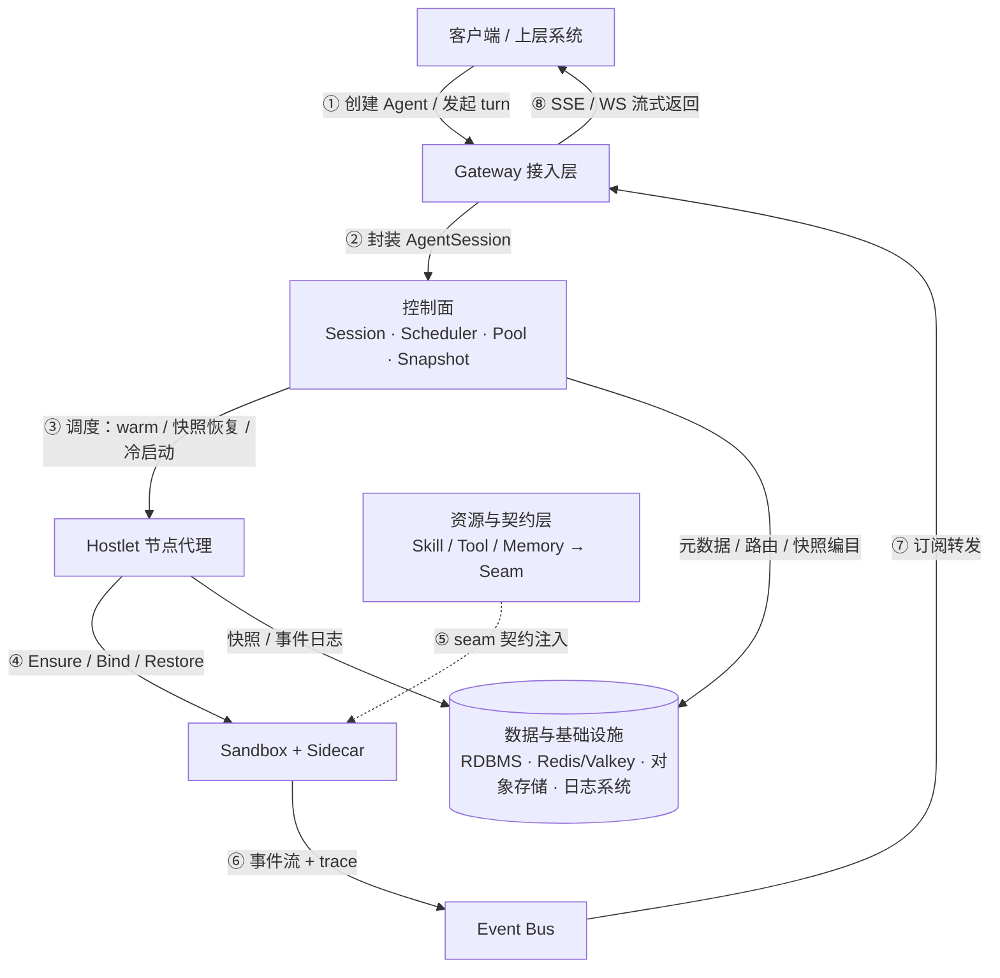
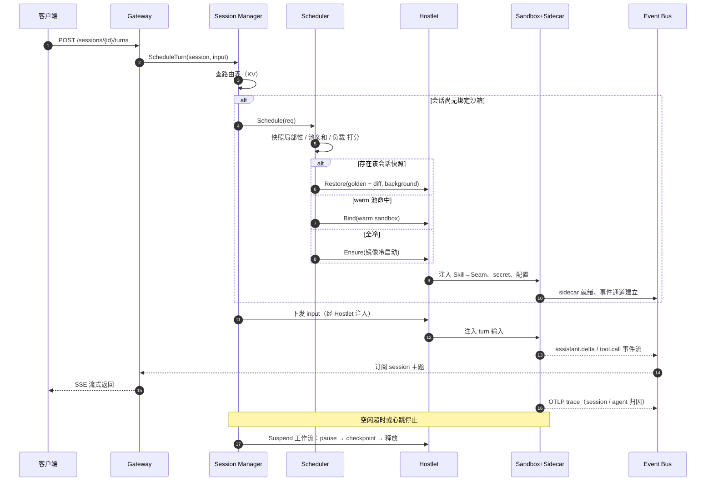
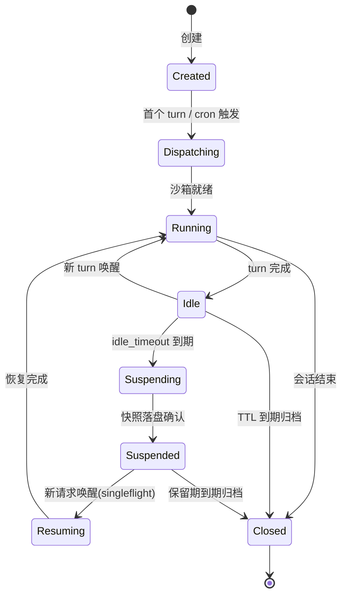
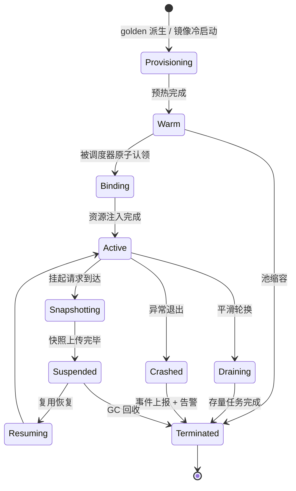

# Agent Runtime 架构设计：harness 无感的沙箱化智能体运行时

[English](agent-runtime-architecture.md) | **中文**

> 架构设计文档 · 工作草案

以 AgentSession 为调度单元、以受管沙箱为执行单元的平台系统。直接采用 gVisor / Firecracker / microsandbox 作为沙箱底座、dsh 作为 harness 执行体，通过组件网络与路由、actor/worker 多路复用与快照分层、Capability Seam 能力契约等机制，实现任意 agent harness 的无感挂载。

- **版本**：v0.6（草案，供评审）
- **日期**：2026-08-18
- **状态**：架构设计阶段
- **代号**：Whirlwind（占位）

## 目录

- [01 设计目标与核心原则](#01-设计目标与核心原则)
- [02 总体架构](#02-总体架构)
- [03 模块定义](#03-模块定义)
- [04 关键接口](#04-关键接口)
- [05 领域模型](#05-领域模型)
- [06 横切设计](#06-横切设计)
- [07 参考项目对照](#07-参考项目对照)
- [08 演进路线与开放问题](#08-演进路线与开放问题)
- [09 为什么目标场景不直接用 Kubernetes](#09-为什么目标场景不直接用-kubernetes)
- [10 部署能力](#10-部署能力)
- [参考来源](#参考来源)

---

## 01 设计目标与核心原则

一句话定位：把任意 agent harness（如 dsh，或自研 loop）当作黑盒进程装进受管沙箱（gVisor / Firecracker / microsandbox），平台统一负责会话路由、沙箱调度、快照恢复、池化预热、事件流与 trace 采集，以及 skill / tool / memory 资源的注入。

### 1.1 要解决的问题

agent 类负载有三个与生俱来的特征，直接决定了架构形态。其一，**负载高度突发**：绝大多数时间在等待输入或工具结果，真正执行的时间占比很低[1](#cite-1)。其二，**执行体不可信**：agent 会运行模型生成的代码，必须隔离在沙箱中，导致单租户、实例海量。其三，**harness 生态碎片化**：各框架的循环、工具、会话模型互不兼容，平台若绑定任何一家 API 就会随其演进被锁死。

因此系统的立足点是：平台只与「沙箱 + 事件 + 能力契约」打交道，永远不与具体 harness 的内部 API 打交道。

### 1.2 四条核心原则

| 原则 | 含义 | 机制要点 |
| --- | --- | --- |
| **无感（harness-agnostic）** | 平台契约只约定三件事：进程运行环境（沙箱）、事件出口（EventTap）、能力入口（Seam Provider）。满足契约的任意 harness 镜像即可热插拔挂载，平台不修改其任何代码。 | dsh 执行世界聚合 + actor 黑盒模型 |
| **组件网络与路由** | 三层组件寻址、lease 自注册、输入经控制面分发、输出统一进事件总线、路由策略可插拔。把 agent-session 当请求、沙箱池当 worker 集群、快照局部性当亲和分。 | 组件寻址 / lease 发现 / 统一事件总线 |
| **沙箱即执行单元** | 所有 agent 执行都发生在受管沙箱内。逻辑执行体（会话状态）与物理沙箱解耦，经 golden 快照 + diff 层多路复用：少量 warm 沙箱承载大量休眠会话。 | actor/worker 多路复用 + 快照分层 |
| **双层资源契约** | 上层保持平台概念 skill / tool / memory，可版本化、可审计；下层编译为 Capability Seam（Definition / Provider / Consumer 三元组），经 harness adapter 桥接到各 harness 的原生工具协议。 | dsh 的 Capability Seam 契约抽象 |

### 1.3 非功能能力

| 维度 | 能力描述 | 支撑机制 |
| --- | --- | --- |
| 激活延迟 | 提供多级激活路径（warm 认领 / 快照恢复 / 冷启动），按唤醒频率自动选择最优路径，避免每次请求都冷启动 | warm 池 + golden 快照派生 + 后台恢复（内核先行） |
| 隔离 | 每会话独立沙箱；网络默认拒绝，出站仅允许经 sidecar 代理，按 seam 细粒度管控目标 | SandboxClass 隔离矩阵 + 用户态网络策略 |
| 密度 | 逻辑会话与物理沙箱解耦；大量休眠会话复用少量活跃沙箱；分层快照存储控制成本 | suspend 释放 worker + 分层快照存储 |
| 可回放 | 每一个模型可见输入都可从事件日志重建，支持断线续传与事故排查 | append-only SessionEvent 日志（模型可见即记录） |
| 可观测 | 每条流都能按 session / agent / sandbox 三级归因；业务事件与工程 trace 双通道分离 | sidecar 双通道（事件流 + OTLP trace） |
| 可扩展 | 沙箱技术按能力位插拔；新增一种 harness 不改平台内核 | SandboxDriver 单接口多实现 + Harness Adapter |

> **范围界定（v1）**
> 纳入：单 agent 会话的执行、调度、快照、事件流、trace、cron 触发、资源注入、agent team 消息路由。不纳入：多 agent 图编排（预留 graph 抽象位）、训练与 RL 场景、跨集群联邦。

---

## 02 总体架构

五层结构：Gateway 接入、Agent-Session 控制面、Sandbox 数据面、资源与契约层、数据与基础设施层。上层只认 AgentSession，下层只认 Sandbox，两层之间的翻译由控制面完成。

**图 1** 总体架构：五层分层视图（数据流见图 2）


**图 2** 数据流：请求下行路径与事件上行路径



### 2.1 组件网络与路由

系统内部以「组件网络」组织所有可路由的执行单元：每个 `AgentDefinition` 是一类组件，其可执行副本是沙箱池中的 Sandbox 实例。组件通过三层寻址定位——`tenant`（多租户命名空间）→ `AgentDefinition`（一类 agent 的版本化定义）→ `Sandbox 实例`（可路由的执行副本），寻址路径形如 `v1/instances/{tenant}/{agentClass}/{sandboxId}`。

Hostlet 与沙箱实例启动时向注册中心自注册（lease 心跳，TTL 到期自动摘除），路由表据此自愈，无需中心化心跳扫描。调度器对一次会话请求做路由决策，打分维度：**快照局部性**（优先调度到持有该会话最新快照的节点）、warm 池水位、节点余量、租户隔离。当前假定系统同时只运行一类 sandbox，调度请求无需携带类型 / 标签 / 资源额度，快照亲和由控制面根据会话历史快照自动推导。

沙箱无入站请求面，出站统一经 sidecar 代理：用户输入经 Gateway 封装为 AgentSession 后由控制面调度到沙箱执行，沙箱不暴露任何入站端口；沙箱内 harness 的出站网络（LLM 调用、工具外呼等）统一经 sidecar 代理转发——LLM 请求由 sidecar 持有 provider 凭证与 token 代为出网，token 与密钥不进沙箱，调用同时被记录用于计量与审计；事件与 trace 统一经 Event Bus 广播，业务面订阅消费。预热好的 warm 沙箱与活跃沙箱分工，构成「预热 / 执行」两段式流水线。

### 2.2 租约机制：三层职责分离

系统内的 lease 不是单一机制，而是三个不同位置的租约，形式不同、解决的问题也不同。核心原则是：**续租方必须是它所断言存活的那一方**——注册租约断言沙箱存活，由 sidecar 续；绑定租约断言控制面存活，由控制面续。

| 租约 | 形式 | 续租方 | 解决的问题 |
| --- | --- | --- | --- |
| **注册 lease（存活租约）** | Redis lease · TTL 15s · KeepAlive 周期续租 | sidecar / Hostlet（沙箱侧） | 沙箱崩溃后 key 自动摘除，路由表自愈；无需中心化心跳扫描，避免成千上万沙箱逐一心跳打垮注册中心。 |
| **绑定 lease（会话持有租约）** | `session→sandbox` 绑定 + 控制面周期续租 | 控制面（持有方） | 控制面失联后租约到期，沙箱判定不再被任何会话持有，进入 draining / 回收，防止孤儿沙箱永久占用资源。 |
| **路由 epoch（防脑裂）** | 绑定携带单调递增 epoch · 请求须携带校验 | 控制面（分配时递增） | 控制面故障切换后残留旧路由；新调度器递增 epoch，过期请求被沙箱拒绝，防止两个控制面同时操作一个沙箱。 |

### 2.3 一次对话请求的完整生命周期

冷路径（无可用沙箱）与热路径（warm 池命中或快照恢复）在调度器内收敛为同一个 Restore/Bind 决策，之后的流程完全一致：

**图 3** 会话请求时序：冷启动、warm 复用、快照恢复三路收敛



### 2.4 关键设计决策

| 决策 | 理由 |
| --- | --- |
| **AgentSession 是唯一调度单元** | Gateway 只产生会话、不感知沙箱细节；控制面的全部状态机、路由表、配额都挂在会话上——贯穿全系统的「中间概念」。 |
| **逻辑会话与物理沙箱解耦** | 会话状态可快照落盘；沙箱可回收复用；两者经 KV 路由表动态绑定——高密度的前提。 |
| **沙箱无入站请求面，出站走 sidecar 代理** | 沙箱不暴露入站端口；输入经控制面分发；出站网络（LLM 调用等）统一由 sidecar 代理，token 与凭证不进沙箱；事件与 trace 统一进 Event Bus 广播、业务面订阅消费。 |
| **存储分工** | RDBMS 存慢变元数据与历史（可审计），KV 存高频动态态（路由/热态），对象存储存大对象（快照/工件），专门日志系统存事件日志。任何一种存储不出现在别人的热路径上。 |
| **Sidecar 标准件随沙箱注入** | EventTap / TraceRelay / Injector / ControlAgent / LLM Relay 五件套构成平台与沙箱内世界的唯一边界——harness 无感运行的实现载体。 |
| **golden 快照 + diff 层** | AgentVersion 级 golden 基线 + 实例级增量（full / data-diff），恢复时叠加应用；预热从 golden 派生。 |
| **SandboxDriver 单接口多实现** | gVisor / Firecracker / microsandbox 三条技术路线以能力声明（caps）区分，调度器按需选择。平台直接采用开源沙箱技术，不自研沙箱内核。 |
| **agent team 是独立一等实体** | team 是一组 agent 的编排单元（独立实体、与 agent 多对多），声明协作拓扑（hub 广播 / direct 定向 / router 路由）。router 拓扑的主管 agent 在 agent 定义时配置（选成员兼任，或内建主管）；hub 发言顺序与消息投递语义可配置，缺省由 supervisor 指定。平台只做消息路由，无内置编排引擎。team 不拥有会话：成员会话保持独立，消息投递即目标成员会话的 turn 输入；目标无活跃会话时经标准调度唤醒。 |

---

## 03 模块定义

每个模块给出职责、关键行为与失败语义。命名采用「层-序号」，与图 1 对应。

### 3.1 Gateway 层

| 模块 | 名称 | 职责与关键行为 |
| --- | --- | --- |
| G1 | `API Server` | 对外 REST 入口。agent 与版本的 CRUD、会话创建、消息分发、事件订阅（SSE / WS）、cron 与保活管理。处理租户认证、限流、幂等键校验。无状态水平扩展。 |
| G2 | `Session Assembler` | 将各类触发源（用户消息、cron、webhook、team 消息）统一封装为 `AgentSession` + `TurnRequest`。 |
| G3 | `Cron Scheduler` | **业务时间触发**：cron 从属于 agent；到点扫描 `CronJob`，按输入模板组装合成会话交 G2 分发。它回答「这个 agent 何时该干活」——产生新会话。分布式锁保证跨集群 at-least-once 触发，触发请求携带幂等键由控制面去重。 |
| G4 | `Keepalive Manager` | **会话保活管理**：消费 touch 心跳续约，判定 idle_timeout（静默到期 → 挂起）与 max_duration（超长 → 强制归档）。它回答「这个既有会话还能活多久」——只作用于存量会话，永不产生新会话。两者共用时间轮与分布式锁基建，但业务上互不感知、独立演进：触发失败不影响保活判定，反之亦然。 |
| G5 | `Stream Egress` | 订阅 Event Bus 上的 `sessions.{id}.stream` 主题并转发给客户端。断线重连时以事件 `seq` 为游标从事件日志续传（Last-Event-ID 语义），保证不丢不重。 |

### 3.2 控制面（L3）

| 模块 | 名称 | 职责与关键行为 |
| --- | --- | --- |
| C1 | `Session Manager` | AgentSession 状态机的持有者。维护 KV 路由表（session → sandbox 映射，带 epoch 防脑裂）；发起 bind / suspend / resume / close 决策；对同一会话的并发唤醒做 singleflight 合并（首个请求触发恢复，后续请求等待合并）。 |
| C2 | `Placement Scheduler` | 接收会话的调度需求，输出候选沙箱。打分维度：快照局部性、warm 池水位、节点余量、租户隔离。策略枚举可插拔：`WarmFirst`、`SnapshotLocal`、`LeastLoaded`、`PowerOfTwo`。warm 沙箱认领为原子 CAS 操作，防止双重认领。同时只运行一类沙箱，无需类型过滤。 |
| C3 | `Lifecycle Engine` | 生命周期引擎；suspend / resume / snapshot / gc 都表达为 `ensure_*` 步骤链：每步从持久化状态推导进度，幂等、可重入，每步独立 span。任一步失败，整个流程停在当前步；重试从断点续跑而非从头重启。 |
| C4 | `Pool Manager` | 维护各 `SandboxPool` 的 warm 目标水位；预热流水线 = 从池对应 AgentVersion 的 golden 快照派生新沙箱；执行 draining（Draining：完成在途任务、拒绝新绑定）与池弹性伸缩。 |
| C5 | `Snapshot Manager` | 快照编目与生命周期。三种快照：golden（AgentVersion 级基线）、full（内存 + 磁盘）、data-diff（仅数据增量）。管理 manifest、保留策略、引用计数与 GC；编排上传/下载的并发与限速。 |
| C6 | `Registry / Discovery` | Hostlet 与沙箱实例经 Redis lease 自注册（TTL 到期自动摘除）；对外提供 list-and-watch 流。寻址路径：`v1/instances/{tenant}/{agentClass}/{sandboxId}`。 |

### 3.3 数据面（L2）

| 模块 | 名称 | 职责与关键行为 |
| --- | --- | --- |
| D1 | `Hostlet` | 节点级守护进程（DaemonSet），沙箱的「牧羊人」。执行 Ensure / Bind / Pause / Checkpoint / Restore / Destroy；处理节点上的快照上传/下载、本地快照缓存与镜像 GC；向控制面上报节点容量与沙箱健康事件。 |
| D2 | `SandboxDriver` | 沙箱技术的统一抽象层。三种实现：`runsc-driver`（gVisor，进程级，高密度，原生 checkpoint）、`firecracker-driver`（microVM，强隔离，内存快照 mmap-COW 恢复）、`libkrun-driver`（microsandbox，磁盘快照 + 亚 100ms 冷启动）。差异经能力位声明，调度器据此过滤。 |
| D3 | `Sidecar 标准件` | 装进每个沙箱的平台 agent，五职责合一：EventTap（采集 harness 输出并归一化为平台事件）、TraceRelay（将沙箱内 OTLP 经隧道中继并附加 session / agent 归因）、ResourceInjector（skill / seam provider / secret 的注入与挂载）、ControlAgent（健康探测、控制命令、优雅关停）、LLM Relay（沙箱内 LLM 调用的出站代理：持有 provider 凭证与 token，提供唯一出网路径，记录调用用于计量与审计）。 |
| D4 | `Event Bus` | NATS / Redis Stream。主题约定：`sessions.{id}.stream`（业务事件）、`sessions.{id}.trace`（trace 批次）、`sandbox.{id}.health`、`pool.{id}.events`。at-least-once 投递；消费端按 seq 去重。 |

### 3.4 资源与契约层（L1）

| 模块 | 名称 | 职责与关键行为 |
| --- | --- | --- |
| R1 | `Resource Registry` | skill / tool / memory 的版本化注册中心（RDBMS）。skill 是带元数据的能力包（入口、依赖、权限声明）；tool 是可执行的工具描述；memory 是存储绑定（会话内 / 长期 / 向量检索）。全部支持内容寻址与不可变版本。 |
| R2 | `Seam Renderer` | 编译器：输入 AgentVersion 定义 + 资源引用，输出 SeamBindings 清单——每条绑定是完整三元组（Definition 接口、Provider 实现、Consumer 暴露）。渲染结果在沙箱创建时注入；是「上层概念」到「底层契约」的唯一翻译点。 |
| R3 | `Harness Adapter` | 一个 harness 一个 adapter，以「镜像 + 配置模板」分发：dsh 直接映射原生 seam；其他 harness 统一暴露为 MCP Server。adapter 失败即 fail-closed，不静默降级。平台直接采用 dsh 作为默认 harness，不自研 harness 内核。 |

> **为什么 Renderer 与 Adapter 分开**
> Renderer 关心「这个 agent 需要哪些能力、以什么策略提供」，是平台语义；Adapter 关心「这些能力在某个 harness 里如何暴露给模型」，是生态语义。两者解耦后，新增一个 harness 不动资源模型，新增一种资源不动任何 adapter 的内核逻辑。

### 3.5 数据层（L0）

| 存储 | 承载内容 | 访问模式 |
| --- | --- | --- |
| RDBMS（PostgreSQL） | 租户、AgentDefinition / AgentVersion、AgentTeam、会话元数据、事件索引、skill / seam 注册、cron、快照编目、审计日志 | 低频读写、事务、审计查询；事件正文进专门日志系统，库里只留索引 |
| Redis / Valkey | Hostlet / 沙箱实例注册（lease TTL）、会话路由表（热路径）、沙箱动态态、singleflight 锁、分布式锁 | 毫秒级读写；全部可从 RDBMS 重建（丢失可恢复） |
| 对象存储 | 快照（memory / vmstate / disk diff）、skill 工件、事件日志离线归档 | 追加写、按需读；快照按 manifest 组织，支持范围拉取 |
| 专门日志系统 | 会话事件日志（EventTap 输出的 JSONL 流，按 session / agent 归因建索引） | 追加写、按 seq 区间回放；查询接口保持开放（见 8.2），后续接入选型 |

---

## 04 关键接口

四类契约自外向内：对外 REST API、控制面 HTTP API、节点面 HTTP API、沙箱内 Sidecar 契约，最后是资源层的 Seam IDL。内部服务间统一走 HTTP/JSON，避免引入额外 RPC 框架。

### 4.1 对外 API（REST）

```text
# ---- Agent 管理 ----
POST   /v1/agents                          创建 AgentDefinition
GET    /v1/agents/{agent}
PUT    /v1/agents/{agent}                   更新定义（产生新 AgentVersion，触发 golden 快照重建）
POST   /v1/agents/{agent}/versions/{v}/promote   灰度提升默认版本

# ---- Team 管理（agent team 机制：独立一等实体，见 5.1 / 8.2）----
POST   /v1/teams                           创建 AgentTeam（成员 agent 引用 + 角色 + 协作拓扑 hub / direct / router；router 拓扑须配置 supervisor：选择成员兼任或内建主管 agent；hubOrder 与 delivery 为可配置项，缺省由 supervisor 指定）
GET    /v1/teams/{team}
POST   /v1/teams/{team}:join / :leave      成员动态加入 / 退出
POST   /v1/teams/{team}/messages           向 team 投递消息：hub 拓扑下全体成员可见，direct / router 拓扑下按路由结果投递到目标成员——统一作为目标会话的 turn 输入

# ---- 会话与消息 ----
POST   /v1/agents/{agent}/sessions          创建会话
GET    /v1/sessions/{sid}
POST   /v1/sessions/{sid}/turns             发起一轮对话（响应为 SSE 流）
GET    /v1/sessions/{sid}/events?from_seq=  事件回放 / 断线续传
POST   /v1/sessions/{sid}:resume            恢复会话（挂起由 idle_timeout 自动触发，无需显式 suspend）
POST   /v1/sessions/{sid}/heartbeat         touch 续活（G4 Keepalive Manager 消费）

# ---- 触发器与管理（cron 从属于 agent）----
POST   /v1/agents/{agent}/crons              为某 agent 注册定时任务（schedule + 输入模板 + 会话策略）
GET    /v1/agents/{agent}/crons/{id}/runs
GET    /v1/pools · /v1/classes · /v1/snapshots    管理面只读视图
```

### 4.2 控制面 HTTP API（Gateway → 控制面，Hostlet → 控制面）

```text
# ---- 调度与路由（Gateway → 控制面）----
POST   /internal/control/schedule           # 幂等键 = session_id + epoch；内部完成 singleflight 合并
GET    /internal/control/route?session_id=  # 查询会话当前路由
POST   /internal/control/suspend
POST   /internal/control/resume
POST   /internal/control/close

# ---- Hostlet 上行（Hostlet → 控制面）----
POST   /internal/control/hosts/register     # 节点自注册（lease 续约）
POST   /internal/control/sandbox-events     # 沙箱事件上报（at-least-once，带 seq）

# 请求体（JSON）
POST /internal/control/schedule
{
  "session_id": "s_...",
  "agent_id": "a_...",
  "agent_version": "v3"
  // 系统同时只运行一类 sandbox，无需 class / 标签 / 资源额度 / 亲和提示
  // 快照亲和由控制面内部根据会话历史快照自动推导
}
// 响应
{
  "sandbox_id": "sb_...",
  "source": "WARM",                      // WARM / SNAPSHOT_FULL / SNAPSHOT_DATA / COLD
  "route_epoch": 42                      // 防脑裂：下发请求须携带
  // 无请求面直连地址：沙箱不对业务面暴露端口，输入经控制面、Hostlet 注入，输出统一进事件总线
}
```

### 4.3 节点面 HTTP API（控制面 → Hostlet）

```text
# ---- 沙箱生命周期（控制面 → Hostlet）----
POST   /internal/hostlet/ensure            // restore_source: golden | full | data | none(冷启动)
POST   /internal/hostlet/bind              // 注入 SeamBindings 清单、secret 引用、事件通道票据
POST   /internal/hostlet/turn              // 向沙箱注入一轮 turn 输入（input + 上下文），沙箱无请求面直连端口
POST   /internal/hostlet/pause
POST   /internal/hostlet/checkpoint        // kind = FULL（内存+磁盘）| DATA（仅数据层）
POST   /internal/hostlet/destroy           // reason + grace
GET    /internal/hostlet/events            // SSE：Hostlet → 控制面 事件流
```

### 4.4 SandboxDriver 抽象（Hostlet 内部）

```rust
#[async_trait]
pub trait SandboxDriver: Send + Sync {
    fn class(&self) -> &'static str;               // "runsc" | "firecracker" | "libkrun"

    fn capabilities(&self) -> Caps {
        Caps {                             // 能力位，调度器据此过滤
            snapshot_full: bool,           // 内存+磁盘快照（firecracker / runsc）
            snapshot_data: bool,           // 仅磁盘层（libkrun）
            background_restore: bool,      // 内核态先行恢复（runsc）
            net_policy: bool,              // 用户态网络策略（libkrun）
            density: Density,              // High | Medium | Low
        }
    }

    async fn create(&self, spec: SandboxSpec, from: Option<RestoreSource>)
        -> Result<Instance>;
    async fn exec(&self, id: &str, cmd: ExecSpec) -> Result<ExecStream>;
    async fn pause(&self, id: &str) -> Result<()>;
    async fn checkpoint(&self, id: &str, kind: CheckpointKind)
        -> Result<SnapshotArtifact>;
    async fn restore(&self, art: &SnapshotArtifact, opts: RestoreOpts)
        -> Result<Instance>;               // opts.background = true 时立即返回
    async fn destroy(&self, id: &str, grace: Duration) -> Result<()>;
}
```

**为什么不用 process / microvm / lightvm 三分类**：三分类是「隔离强度」单维度分类，而真实沙箱技术是多个正交维度的组合——gVisor 进程级 + 用户态内核、Firecracker microVM 硬件隔离、microsandbox 轻量 VM，它们在内存快照、磁盘快照、后台恢复、网络模式、冷启动、密度上各有差异。三分类强迫把技术塞进不合适的桶，也无法表达「Firecracker 支持内存快照但 microsandbox 不支持」这类差异；未来加 WASM、runc 容器、裸进程时又要扩成四档五档。

正确做法是让 `capabilities()` 能力位从「辅助声明」升级为**调度决策的唯一依据**：

```rust
struct Caps {
    isolation: Isolation,        // Process | MicroVM | LightVM | Wasm ...
    snapshot_full: bool,         // 内存+磁盘快照
    snapshot_data: bool,         // 仅磁盘层
    background_restore: bool,    // 内核态先行恢复
    net_policy: bool,            // 用户态网络策略
    density: Density,            // High | Medium | Low
    cold_start_ms: u32,          // 冷启动量级，供预热深度决策
}
```

`class()` 降级为人类可读标签。调度器按 AgentVersion 声明的**需求**（隔离等级、快照需求、网络策略、密度）匹配能力位，而非匹配「第几档」。新增一种沙箱技术 = 新增一个 driver 实现 + 声明能力位，不动调度器逻辑。接口另建议补 `configure_network(policy)`（deny-by-default 策略注入）与 `mount(spec)`（workspace / seam provider 挂载）——网络与文件系统挂载是沙箱差异最大的两个面，塞不进 `create`。当前系统同时只运行一类 sandbox，能力位主要描述 driver 自身差异并为未来多类型扩展预留，调度器当前无需按类型过滤。

### 4.5 Sidecar 契约（沙箱内标准件）

EventTap 的输出是统一 JSONL 事件流，字段与统一会话日志模型对齐（seq 单调、可辨联合类型、surface 改写语义）：

```json
// sessions.{sid}.stream 上的事件（at-least-once，消费端按 seq 幂等）
{"type":"turn/start",        "seq":1021, "ts":1755...,
 "data":{"input_ref":"obj://..."}}
{"type":"assistant/chunk",   "seq":1022, "ts":...,
 "data":{"delta":"让我先看"},
 "surface":{"op":"append"}}                // 压缩改写用 op=replace + [start,end)
{"type":"tool/call",         "seq":1030, "ts":...,
 "data":{"tool":"fs.write","seam":"fs.v1","args":{...}}}
{"type":"tool/result",       "seq":1031, "ts":..., "data":{...}}
{"type":"turn/end",          "seq":1034, "ts":..., "data":{"usage":{...}}}
```

```text
// 控制通道（ControlAgent，HTTP over vsock / UDS）
HealthCheck / PreparePause（flush 事件流） / SnapshotAck / GracefulStop(reason)

// LLM 出站通道（LLM Relay，HTTP over vsock / UDS）
POST /llm/chat        // 沙箱内 harness 的 LLM 调用经此出网：sidecar 附加 provider 凭证与归因，记录调用用于计量 / 审计
GET  /llm/token       // 按需签发短期 token，凭证与 token 不入沙箱镜像 / 快照
```

### 4.6 Seam IDL 与绑定清单

Seam 的三角色定义以 IDL 登记（TS / proto 双形态），AgentVersion 通过 YAML 声明绑定。以下示例展示同一 `fs` 能力在三种 harness 下的不同暴露：

```yaml
# AgentVersion 中的 seam 绑定声明（Seam Renderer 的输入）
seamBindings:
  - seam: fs.v1                       # Definition：registry://seams/fs@1.4.0
    provider:
      name: sandbox-fs                # Provider：沙箱内实现，随镜像分发
      policy:
        mode: workspace-write         # read-only | workspace-write | full
        workspaceRoot: /workspace
    consumers:
      - harness: dsh                  # 原生 seam，零适配
      - harness: "*"                  # 兜底：暴露为 MCP Server

  - seam: shell.v1
    provider: { name: sandbox-bash, policy: { mode: workspace-write } }
  - seam: memory.v1
    provider:
      name: redis-memory              # Provider 在宿主侧，secret 不进沙箱
      endpoint: { kind: host-relay }  # 经 sidecar 隧道访问，按目标门控
```

> **契约分层小结**
> REST 面向调用方，HTTP API 面向内部服务，Driver 面向沙箱技术，Sidecar 面向沙箱内世界，Seam 面向能力生态。五层契约互不越界：Gateway 永不直连 Hostlet，控制面永不解析事件正文，沙箱内世界只见到 Sidecar 与注入的资源。

---

## 05 领域模型

实体分为三组：定义组（描述「agent 是什么」）、运行组（描述「一次执行」）、资源组（描述「agent 用什么」）。关系如下：

**图 4** 领域模型：定义组、运行组、资源组的关系（图片版）


### 5.1 定义组

| 实体 | 关键字段 | 说明 |
| --- | --- | --- |
| `AgentDefinition` | `name · displayName · defaultVersion · owner` | 一类 agent 的逻辑名。不可变的是身份，可变的是默认版本指针。 |
| `AgentVersion` | `harness · image · entrypoint · sandboxClass · labels · seamBindings[] · skillRefs[] · memoryRefs[]` | 不可变的部署单元：harness 类型与镜像、入口、沙箱档位、能力绑定全部冻结于此。**该 agent 关联的各类 seam（shell / fs / memory / subagents 等）在此经 `seamBindings[]` 声明**，随版本一起冻结；版本一旦创建永不修改、只被替换。full / data 快照档位不在此自选，由 `SandboxClass` 决定。 |
| `SandboxClass` | `driver · snapshotCaps · netPolicy · density` | 沙箱技术档位（gVisor / Firecracker / microsandbox），携带能力声明。当前系统只运行一类，作为未来多类型扩展的抽象位。 |
| `AgentTeam` | `name · members[]（AgentDefinition 引用 + role） · topology · supervisor · hubOrder · delivery · quota` | **独立一等实体**：一组 agent 的编排单元，与 agent 多对多引用，不从属于任何单个 agent。`topology` 声明成员间协作拓扑：`hub`（广播——任一成员的输出全体成员可见，适合群聊 / 辩论式协作）、`direct`（定向——成员指定目标成员点对点投递）、`router`（路由——指定成员充当路由者，决定下一个发言成员及其输入）。`supervisor` 声明 router 拓扑的主管 agent——**在 agent 定义时配置**：或选某个成员 agent 兼任主管，或内建专门的主管 agent（普通成员 + 主管角色）；平台只按配置执行路由，不实现编排逻辑。`hubOrder`（自由抢占 / 轮转）与 `delivery`（at-least-once 与去重窗口）为可配置项，缺省由 supervisor 在运行期指定。team 不拥有会话——成员会话保持独立，「会话是唯一执行单元」的原则不变；team 只提供消息路由：投递到 team 的消息成为目标成员会话的 turn 输入，目标无活跃会话时经标准调度唤醒。team 级消息速率配额防止广播风暴。 |

### 5.2 运行组

| 实体 | 关键字段 | 说明 |
| --- | --- | --- |
| `AgentSession` | `agentVersionId · status · bindSandboxId · routeEpoch · idleDeadline · maxDuration` | 全系统调度的中间概念；调度与计费的基本单元。 |
| `SessionEvent` | `sessionId · seq · type · ts · data · surface` | append-only 日志中的一行。`seq` 在会话内单调连续；`surface` 携带 append / replace 语义。 |
| `Sandbox` | `classId · poolId · workerId · status · bindSessionId · lastSnapshotId` | 物理执行体。生命周期独立于会话：由池预热、被会话租用、快照后回收。 |
| `Worker` | `nodeId · capacity · state(ACTIVE/DRAINING) · labels` | Hostlet 管理的节点容量视图；容量感知调度的输入。 |
| `Snapshot` | `kind(golden/full/data) · subject · manifest · location · size · merkle` | golden 指向 AgentVersion（模板基线）；full / data 指向具体沙箱（实例增量）。manifest 描述分层结构；merkle 根用于完整性校验。 |
| `CronJob` | `agentDefinitionId · schedule · inputTemplate · sessionPolicy` | 时间触发定义，从属于 agent（`agentDefinitionId` 外键）：到点后 G3 为该 agent 组装合成会话。 |

### 5.3 资源组

| 实体 | 关键字段 | 说明 |
| --- | --- | --- |
| `SkillPackage` | `kind · version · contentRef · permissions[]` | 上层概念：技能包（入口、依赖、权限声明）。版本不可变、内容寻址。 |
| `MemoryStore` | `type(session/longterm/vector) · backend · namespace` | 存储绑定声明。会话内内存随快照走；长期内存经 host-relay 访问。 |
| `SeamBinding` | `seamId · providerSpec · consumers[]` | 下层契约：Renderer 的编译产物，随 Bind 请求注入沙箱。 |

### 5.4 状态机

两条状态机错开半拍：会话先进入挂起意图，沙箱随后完成快照并回池。会话状态是面向用户的真相源，沙箱状态是面向资源的真相源：

**图 5** AgentSession 状态机



**图 6** Sandbox 状态机



> **挂起工作流的 ensure 步骤链（Lifecycle Engine 执行）**
> `ensure_actor_lock` → `ensure_paused`（flush 事件流 + 冻结进程）→ `ensure_snapshot_uploaded`（full 或 data，按策略）→ `ensure_route_cleared`（删 KV 路由）→ `ensure_worker_released`（沙箱回池或销毁）→ `finalize_suspended`。每步幂等、可重入、独立 span；恢复工作流是其镜像（锁 → 解析引导源 → 认领 worker → restore → finalize_running）。

---

## 06 横切设计

### 6.1 可观测性：双通道与归因

sidecar 的两条出口通道服务不同消费者。**业务事件流**（EventTap → Event Bus → Stream Egress / 事件日志）面向终端用户与会话回放，语义是「模型看到过什么、做过什么」；**trace 通道**（TraceRelay → OTLP collector → 后端）面向工程观测，语义是「智能体内部如何执行」。所有出沙箱的遥测统一附加三级归因：`session_id / agent_id / sandbox_id`。事件日志同时充当审计事实源：任何投诉与事故排查都从 seq 区间回放开始，而非从日志碎片拼接。

### 6.2 安全与多租户

| 层面 | 措施 |
| --- | --- |
| 沙箱隔离矩阵 | 系统当前只运行一类沙箱（默认 gVisor，高密度）。隔离矩阵作为未来多类型扩展的参照：gVisor（进程级 + 用户态内核）、Firecracker（microVM，强隔离，面向高风险任务）、microsandbox（轻量 VM）。 |
| 网络 | 默认拒绝的出站策略；沙箱无入站端口，出站统一经 sidecar 代理（LLM 调用、seam host-relay）；私网 / 回环 / 云 metadata 地址一律拒绝；DNS pin + SNI 绑定防伪造；按 seam 细粒度目标准入。 |
| 凭证 | 密钥永不进沙箱镜像或快照：保存在宿主侧，经 sidecar host-relay 按目标门控注入，快照前强制剥离。 |
| 宿主加固 | microVM 进程 jailer 化：chroot、cgroup、fd 清理、uid/gid 降权、只注入必要设备节点。 |
| 配额 | 租户级四配额——并发沙箱数、快照存储、事件吞吐、cron 频率——在 Gateway 与调度器双重执行；team 级配额与 team 机制一同设计（见 8.3）。 |

### 6.3 容量、池化与成本

warm 水位不是静态数字，Pool Manager 按信号调整：`目标 = 近期唤醒速率 × 恢复时长 × 安全系数 + 预留`，另按 cron 日历对可预期的唤醒潮提前预热。节点内存 overcommit 依赖两点支撑：gVisor 档的进程级足迹天然可超卖；Firecracker 档用 balloon 设备回收休眠页。快照存储成本靠分层控制——golden 全量保留、实例 full 快照限保留条数、长期休眠会话降级为 data 快照 + 事件日志（恢复时 golden + data 重建 + 日志重放上下文）。

#### 预热流水线：把冷启动成本前置到发布时

预热的本质是让「激活延迟 p95 < 100ms」成为可能——把镜像拉取、依赖安装、进程启动这些冷启动成本，从「请求到达时」挪到「AgentVersion 发布时」和「空闲时」。流水线如下：

| 阶段 | 动作 | 时机 |
| --- | --- | --- |
| ① golden 快照 | 在 AgentVersion 发布时构建基线快照（镜像 + 依赖 + 基础上下文）；后续一切派生自它 | 发布时 |
| ② COW 派生 | 从 golden 经 copy-on-write 派生实例，避免重复冷启动 | 预热时 |
| ③ 恢复启动 | mmap-COW 按需调页 / 后台恢复（gVisor 内核先行恢复，首条指令立即执行） | 预热时 |
| ④ 注入 sidecar | 注入 EventTap / TraceRelay / Injector / ControlAgent / LLM Relay 五件套 | 预热时 |
| ⑤ Warm 待命 | 注册进池等待认领；调度器经原子 CAS 认领（防止两个调度器抢到同一个 warm 沙箱） | 预热后 |

**分层预热控制成本**：浅预热只把快照拉到节点、mmap 加载，进程不启动，认领时用后台恢复；深预热进程已启动、sidecar 已注入，认领延迟最低但占内存。按唤醒频率决定预热深度——高频 agent 深预热，低频 agent 浅预热或直接冷启动。水位调节公式与 cron 日历预热见上文。

---

## 07 参考项目对照

本设计的每个关键机制都能溯源到具体实现。参考仓库：[Dynamo](https://github.com/ai-dynamo/dynamo)、[Substrate](https://github.com/agent-substrate/substrate)、[DeepSeek Harness](https://github.com/deepseek-ai/deepseek-harness)、[AgentScope](https://github.com/agentscope-ai/agentscope)、[Firecracker](https://github.com/firecracker-microvm/firecracker)、[gVisor](https://github.com/google/gvisor)、[microsandbox](https://github.com/microsandbox/microsandbox)。对照表如下：

| 本设计机制 | 来源 | 借鉴的具体实现 |
| --- | --- | --- |
| 三层寻址与 lease 注册 | [Dynamo](https://github.com/ai-dynamo/dynamo) | `lib/runtime/src/component.rs` 中的 Component / Endpoint / Instance；etcd lease TTL 注册与 list-and-watch trait 抽象（可插拔 etcd / K8s / mock）。 |
| 统一事件总线输出 | [Dynamo](https://github.com/ai-dynamo/dynamo) | ZMQ/NATS 广播（KV blocks、负载）+ TCP 直连（请求）双平面；本系统只取广播面：输入经控制面分发、输出统一进 Event Bus，无请求面直连。 |
| 路由策略枚举 | [Dynamo](https://github.com/ai-dynamo/dynamo) | `routing_policy/types.rs` 中的 RoundRobin / PowerOfTwo / LeastLoaded；`cache_hits` 亲和泛化为快照局部性打分。 |
| actor / worker 多路复用 | [Substrate](https://github.com/agent-substrate/substrate) | Actor 状态机（RUNNING/SUSPENDED/...）、Worker 容量感知调度、warm 池；100ms p95 激活延迟北极星指标。 |
| ensure 步骤工作流 | [Substrate](https://github.com/agent-substrate/substrate) | `workflow_resume.go` 中的幂等步骤链（lock → bootstrap source → volumes → claim → restore → finalize），每步从持久化状态推导进度。 |
| 代理侧唤醒 | [Substrate](https://github.com/agent-substrate/substrate) | Envoy ext_proc 拦截 + singleflight 去重唤醒 + 请求泊车（无空闲 worker 时退避等待）。 |
| golden 快照分层 | [Substrate](https://github.com/agent-substrate/substrate) | ActorTemplate 级 golden + 实例 Full/Data 快照；可配置 `onResume: Golden \| ColdBoot`。 |
| CRD（慢变）/ KV（高频）双层 API | [Substrate](https://github.com/agent-substrate/substrate) | WorkerPool / ActorTemplate 走声明式；Actor / Worker 动态态走 ValKey；避免高频写打 apiserver。 |
| Capability Seam 三元组 | [DeepSeek Harness](https://github.com/deepseek-ai/deepseek-harness) | Service Definition / Provider / Consumer 三角色（`docs/capability-seams.zh.md`）；约 30 个官方 seam（shell、fs、subagents、storage、sessionPersistence…）。 |
| fail-closed 沙箱策略 | [DeepSeek Harness](https://github.com/deepseek-ai/deepseek-harness) | `SandboxProvider.confine(argv, policy)`：策略随调用携带，`enforcement: full \| partial` 显式声明，无后端可用时直接报错不降级。 |
| append-only 会话日志 | [DeepSeek Harness](https://github.com/deepseek-ai/deepseek-harness) | `SessionEvent{type,seq,time,data}`、surface replace 语义、`end-seed` fork 边界、「模型可见即记录」不变量。 |
| 沙箱即工作区分层 | [AgentScope](https://github.com/agentscope-ai/agentscope) | `WorkspaceBase → SandboxedWorkspaceBase` 两层抽象；新后端只需实现 `_provision_backend`；九种后端并列注册。 |
| 统一流式工具接口 | [AgentScope](https://github.com/agentscope-ai/agentscope) | `Toolkit.call_tool → AsyncGenerator[ToolChunk \| ToolResponse]`、细粒度事件流（含 HITL 确认事件）。 |
| 大结果 offload | [AgentScope](https://github.com/agentscope-ai/agentscope) / [dsh](https://github.com/deepseek-ai/deepseek-harness) | `workspace://` URL 引用 + 上下文 offload；dsh spillStore 同一思想。 |
| mmap-COW 快照恢复 | [Firecracker](https://github.com/firecracker-microvm/firecracker) | 内存文件 MAP_PRIVATE 按需调页加载、恢复延迟与内存大小解耦；diff 快照（脏页日志）+ rebase 合并；clone 时 network/vsock 覆写。 |
| 后台恢复 | [gVisor](https://github.com/google/gvisor) | `runsc checkpoint --background`：内核先行恢复、应用立即执行、剩余内存按缺页优先级异步回填，压低首指令延迟。 |
| seccheck 式事件出口 | [gVisor](https://github.com/google/gvisor) | 沙箱主动连接外部 UDS sink 推送结构化事件 + 声明式配置；本系统 EventTap 的原型。 |
| Draining 与续活语义 | [microsandbox](https://github.com/microsandbox/microsandbox) | Draining 状态（完成在途、拒绝新请求）；ping（不续租）/ touch（续租）区分；内建 idle_timeout / max_duration 退出原因码。 |
| 磁盘快照 + warm 派生 | [microsandbox](https://github.com/microsandbox/microsandbox) | 只捕获可写层 + Merkle 完整性树；warm workers 模式：基线快照反复 COW 派生独立 worker。 |
| 宿主侧 secret 门控 | [microsandbox](https://github.com/microsandbox/microsandbox) | secret 永不进 VM、宿主侧注入并按目标主机准入；配合 DNS pin / SNI 绑定。 |

---

## 08 演进路线与开放问题

### 8.1 里程碑

| 阶段 | 目标 | 交付内容 |
| --- | --- | --- |
| M1 | 单节点竖切跑通 | 单进程 all-in-one 模式（内存 provider，见 10.4）；Gateway（agent CRUD + 会话 + SSE）；单一 SandboxClass（从 gVisor 起步）；一个 dsh harness adapter；事件日志（本地 JSONL）；最小 EventTap 事件集（turn / chunk / tool）。 |
| M2 | 完整生命周期 | Lifecycle Engine（suspend / resume 步骤链）；gVisor driver + checkpoint；golden 快照与预热派生；心跳 / idle_timeout / Draining。 |
| M3 | 多节点与池化 | Hostlet + Redis 注册发现；快照局部性路由；warm 池水位管理；Firecracker driver（强隔离档）；Seam Renderer + dsh adapter；端到端 OTLP tracing。 |
| M4 | 规模化运维 | 多租户配额与审计报表；快照 GC 与存储分层降级；microsandbox 轻量档；cron 日历预热；容量弹性；agent team 机制落地（消息路由 + 协作协议）。 |

### 8.2 已定决策

- **事件日志存储**：事件日志后续写入专门的日志系统，不在 RDBMS / 对象存储中承担长期审计存储；RDBMS 只保留事件索引与元数据。
- **快照默认档位**：full / data 快照档位随 SandboxClass 决定，不交给 AgentVersion 的 `snapshotPolicy` 自选。
- **Seam 与 MCP 定位**：Seam 是顶层抽象；MCP 只是兜底 Consumer，不成为平台一等公民，Seam 层保持注册与策略层的完整职责。
- **subagent 归属**：harness 内 subagent 是沙箱内黑盒内部细节，平台只看到事件流，不单独建 AgentSession，不计费不配额。
- **LLM 请求与 token 归属**：LLM 调用与 token 管理是 sidecar 的一类职责（LLM Relay）。沙箱内 harness 的 LLM 调用经 sidecar 出网，provider 凭证与 token 不进沙箱，调用被记录用于计量与审计。
- **控制面技术栈**：Python（asyncio + FastAPI）。控制面是编排逻辑、I/O 密集而非计算密集，不是性能瓶颈，热路径在沙箱内；Hostlet 对 runsc / firecracker 的二进制编排用 subprocess 封装。
- **agent team 机制**：team 是独立的一等实体（与 agent 多对多，不从属于任何 agent），声明协作拓扑（hub 广播 / direct 定向 / router 路由）。team 不拥有会话，只做消息路由：投递消息作为目标成员会话的 turn 输入，目标无活跃会话时按标准调度唤醒。
- **router 拓扑的主管 agent 由定义配置**：router 拓扑的路由者（主管 agent）不在平台内置，而是在 agent 定义时配置——创建 team 时选择某个成员 agent 兼任主管，或内建一个专门的主管 agent（普通成员 + 主管角色）。平台只按配置执行路由，不实现编排逻辑。
- **hub 发言顺序与消息投递语义可配置**：hub 拓扑的发言顺序（自由抢占 / 轮转）与消息投递语义（at-least-once 与去重窗口）均为 team 定义时的可配置项；配置缺省时由 supervisor 在运行期指定。平台只按配置执行，不内置固定策略。
- **定时触发与保活拆分**：cron 触发（G3，产生新会话）与保活判定（G4，作用于存量会话）是两个业务，模块独立、互不感知，仅共用时间轮与分布式锁基建。
- **事件日志查询**：不锁定查询引擎；平台只保证「按 session + seq 回放」这一最小接口（SSE / REST 均可消费），审计查询与全文检索由后续接入的日志系统承担，接口保留开放。

### 8.3 开放问题（已关闭）

agent team 机制的落地细节已全部收敛为已定决策（见 8.2）：主管 agent 由定义配置、hub 发言顺序与消息投递语义可配置（缺省由 supervisor 指定）。当前无待共同决策的开放问题。

> **下一步建议**
> 开放问题已关闭，冻结 M1 的竖切范围，进入实现。

---

## 09 为什么目标场景不直接用 Kubernetes

本系统跑在节点集群上，但不把 Kubernetes 当运行时内核。K8s 管的是「部署拓扑」（哪些服务跑在哪些节点），本系统管的是「会话与沙箱」（哪个会话在哪个沙箱、什么状态、何时挂起恢复）。两者职责不同，直接用 K8s 表达本系统的核心机制会遇到以下错配：

| 错配点 | Kubernetes 的模型 | 本系统的需求 |
| --- | --- | --- |
| 调度频率与粒度 | Pod 调度面向分钟级创建、天级寿命的服务；经 apiserver 的声明式调和每集群撑死每秒几百次写 | 调度单元是 AgentSession：一次对话要经历 warm 认领 → 快照恢复 → 执行 → 挂起 → 释放多次高频迁移——亚秒级认领、每秒成百上千次路由决策；热路径不能过 apiserver |
| 挂起 / 恢复原语缺失 | 没有一等公民的 suspend / resume / snapshot。停 Pod 即丢内存态；「恢复」只能重建进程 | 保内存态是核心价值：mmap-COW 恢复、golden 派生、diff 层叠加。这些必须在沙箱层管理，等于在 K8s 之上重造一层运行时——Pod 只是多余的中间层 |
| 沙箱不是 Pod | 一个 Pod 一棵 cgroup 树、以 Pod 为密度单位；K8s 对 Pod 内部结构完全无感 | 一个 Worker 节点多路复用几十到上百个受管沙箱（gVisor / Firecracker / microsandbox）。一沙箱一 Pod 密度与启动开销不可接受；一 Pod 多沙箱则 K8s 对沙箱的调度、QoS、驱逐语义全部失效 |
| 资源模型表达不了休眠态 | request / limit 描述常驻算力预留；StatefulSet 卷与节点绑定 | 大量会话处于快照态：只耗存储不耗算力、休眠会话与活跃沙箱约 20:1 复用。K8s 没有对应资源形态，全塞自定义资源又回到热路径写 apiserver 的问题 |
| 调度语义不同 | 调度器面向节点拓扑：资源请求、亲和、污点容忍；扩展要走 scheduler framework，复杂且离不开 apiserver | 调度器面向会话语义：快照局部性、warm 池水位、SeamBindings 亲和、资源池水位。打分器要直接操作沙箱池，不是排队等 Pod 绑定 |
| 交付重量 | 一整套控制面（apiserver / etcd / scheduler / controller-manager / kubelet）+ CNI + CSI 是硬依赖，组件数几十个起步 | 目标场景含单机与私有化交付，要求零外部依赖的单进程形态（见 10.4）。以 K8s 为前提，这个形态不存在 |

**结论**：不是「不能用 K8s」，而是分工——K8s 只做它擅长的（模块单元的部署、伸缩、节点管理），会话调度、沙箱生命周期、快照体系由本系统控制面自管。参考项目 Substrate 的 CRD（慢变）/ KV（高频）双层 API 正是同一结论：声明式 API 只放慢变资源（WorkerPool / 模板），高频动态态全部走独立 KV 热路径。因此 K8s 在本系统中以「部署形态之一」出现（10.5），而不是运行时内核。

---

## 10 部署能力

同一套模块代码支持两种部署形态：单进程 all-in-one（零外部依赖）与 k8s / k3s 集群。可替换性的关键在存储与通信全部走 provider 接口。

### 10.1 部署单元

| 部署单元 | 包含模块 | 状态性 | 伸缩方式 |
| --- | --- | --- | --- |
| `gateway` | G1 API Server · G2 Session Assembler · G3 Cron Scheduler · G4 Keepalive Manager · G5 Stream Egress | 无状态（会话游标在存储层） | 水平多副本，客户端侧负载均衡 |
| `control` | Router · Lifecycle Engine · Scheduler | 协调者（全部状态在存储层，进程无状态） | 多副本分片（按会话哈希）或主备 |
| `hostlet` | Hostlet + SandboxDriver + sidecar injector | 节点级有状态（管理本节点沙箱） | 每节点一个，随节点伸缩 |
| `storage` | MetadataStore · KVStore · EventBus · ObjectStore · EventLog（全部 provider 接口，见 10.3） | 持久层 | 按选型独立伸缩 |

沙箱不是独立部署单元：随 hostlet 生命周期由控制面按需创建销毁。

### 10.2 模块间通信形式

| 通信路径 | 形式 | 单进程模式下 |
| --- | --- | --- |
| client ↔ gateway | REST + SSE / WS | 不变（localhost 回环） |
| gateway ↔ control | 内部 HTTP/JSON（`/internal/control/*`） | 退化为进程内函数调用（同一事件循环） |
| control ↔ hostlet | 内部 HTTP/JSON（`/internal/hostlet/*`） | 退化为进程内函数调用 |
| hostlet ↔ sidecar | vsock / UDS（HTTP over） | 不变（沙箱边界不随部署形态改变） |
| 事件流 | EventBus pub/sub（`sessions.{id}.stream` 等主题） | 进程内 asyncio 队列 |

全部模块间通信只有两种载体：HTTP/JSON 请求与 EventBus 消息，无共享内存、无强绑定 IPC——这是单进程模式能无损退化的前提。

### 10.3 系统依赖与可替换性

所有外部依赖收敛为五个 provider 接口，模块只依赖接口；实现按存储类别独立替换，替换不改模块代码：

| 依赖抽象 | 承载内容 | 单进程实现 | 集群实现 |
| --- | --- | --- | --- |
| `MetadataStore` | 租户、Agent / Version、Team、会话元数据、事件索引、cron、审计 | 内存；可选 SQLite 落盘获得重启持久性 | PostgreSQL |
| `KVStore` | lease 注册、会话路由表、沙箱动态态、分布式锁 | 内存（单进程即唯一权威） | Redis / Valkey |
| `EventBus` | 事件流扇出（stream / trace / 控制通知主题） | 进程内 asyncio 队列 | NATS / Redis Streams |
| `ObjectStore` | 快照（memory / vmstate / disk diff）、skill 工件 | 本地目录 | S3 / MinIO |
| `EventLog` | append-only 会话事件日志 | 本地 JSONL 文件 | 专门日志系统（查询接口开放，见 8.2） |

### 10.4 单进程模式（all-in-one）

- **形态**：一个进程包含 gateway、control、hostlet 全部模块与内存存储实现；沙箱底座（runsc / firecracker）仍以本机子进程方式运行，沙箱隔离能力不因单进程而削弱。
- **零外部依赖**：无 PostgreSQL、无 Redis、无 NATS、无对象存储；五个 provider 全部由内存 / 本地文件实现，开箱即用。
- **持久化可选**：默认纯内存（重启即失，适合开发 / CI / demo）；开启落盘后 MetadataStore 走 SQLite、快照与事件日志写本地目录，重启后可从快照恢复休眠会话。
- **限制**：单节点容量、无高可用；适合开发、演示、单机私有化与小规模评估，不是生产形态。
- **扩展位**：单机多进程（systemd / docker compose）是单进程与集群之间的自然中间形态——模块拆进程、依赖仍可用本地文件与嵌入式实现，本文不展开。

### 10.5 k8s / k3s 集群模式

| K8s 对象 | 部署内容 | 要点 |
| --- | --- | --- |
| Deployment + HPA | gateway | 无状态，按 QPS / SSE 连接数伸缩 |
| Deployment | control | 多副本按会话分片；主备模式加租约锁选主 |
| DaemonSet | hostlet | 每节点一个；节点须预装沙箱底座二进制（runsc / firecracker），Pod 需设备与特权容忍 |
| 有状态依赖 | PostgreSQL · Redis/Valkey · NATS · 对象存储 | 云托管或 Operator 部署；EventLog 接专门日志系统 |
| PVC / hostPath | 节点本地快照缓存 | 快照主体在对象存储；节点本地只保存热缓存 |

K8s 在此只负责模块单元的部署与伸缩；会话调度、沙箱生命周期、快照体系全部由 control 自管（理由见 09 章）。k3s 使用同一套 manifests，面向边缘与私有化轻量场景。

---

## 参考来源

1. Google, Agent Substrate Architecture. Actor/worker 多路复用、快照分层与激活延迟目标（100ms p95）。<https://github.com/agent-substrate/substrate/blob/main/docs/architecture.md>
2. NVIDIA, Dynamo. 分布式推理服务框架：组件寻址、etcd lease 发现、广播事件面、可插拔路由。<https://github.com/ai-dynamo/dynamo>
3. DeepSeek, Harness. Everything is a plugin：Cordis 插件内核与 Capability Seam 抽象。<https://deepseek.com/harness/en/>
4. DeepSeek, deepseek-harness 源码仓库。<https://github.com/deepseek-ai/deepseek-harness>
5. AgentScope 团队, AgentScope 2.x 源码仓库。<https://github.com/agentscope-ai/agentscope>
6. microsandbox 项目源码仓库。<https://github.com/microsandbox/microsandbox>
7. AWS, Firecracker 源码仓库。<https://github.com/firecracker-microvm/firecracker>
8. Google, gVisor 源码仓库。<https://github.com/google/gvisor>

